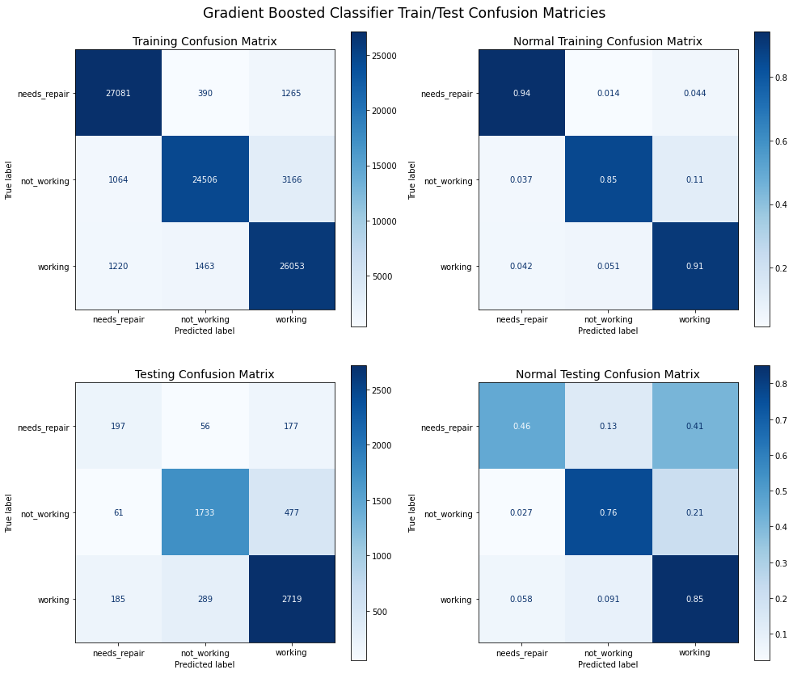
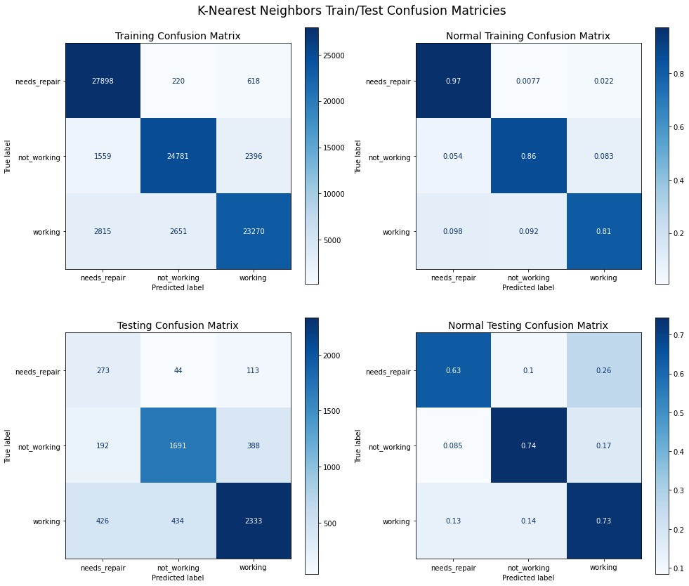
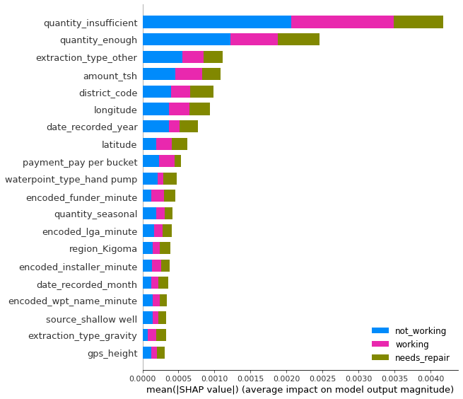
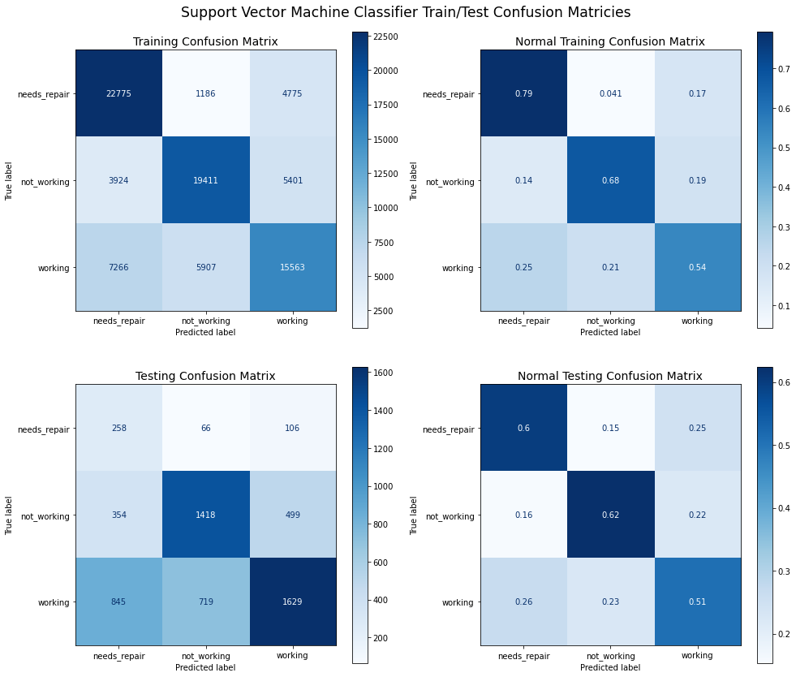
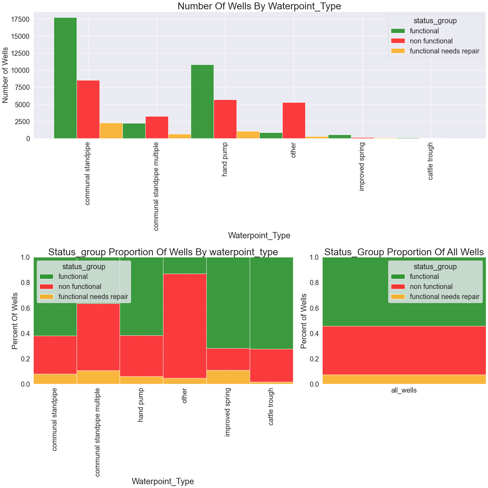
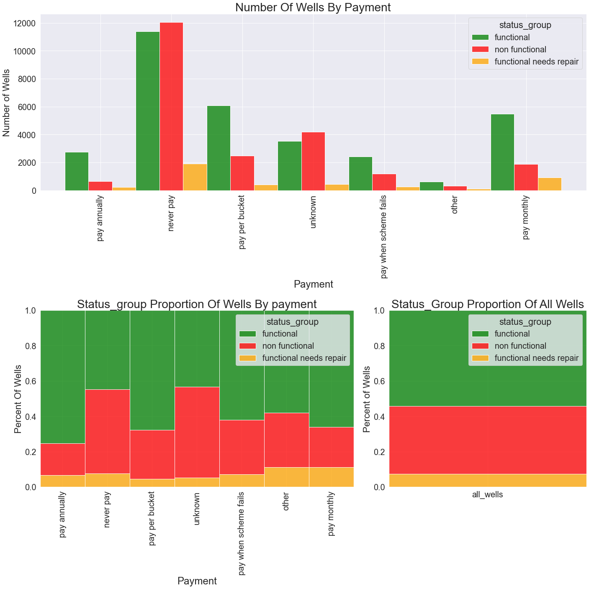
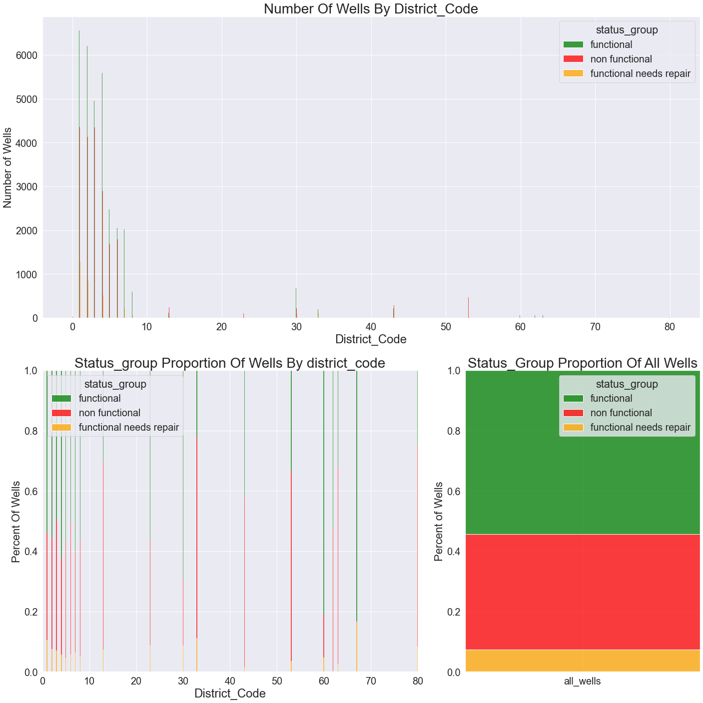
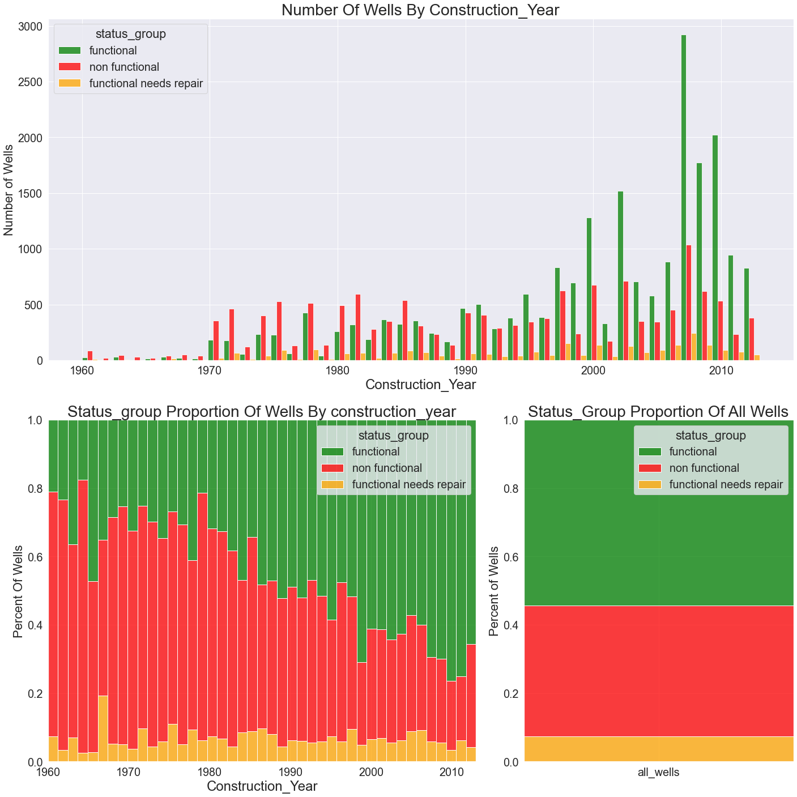
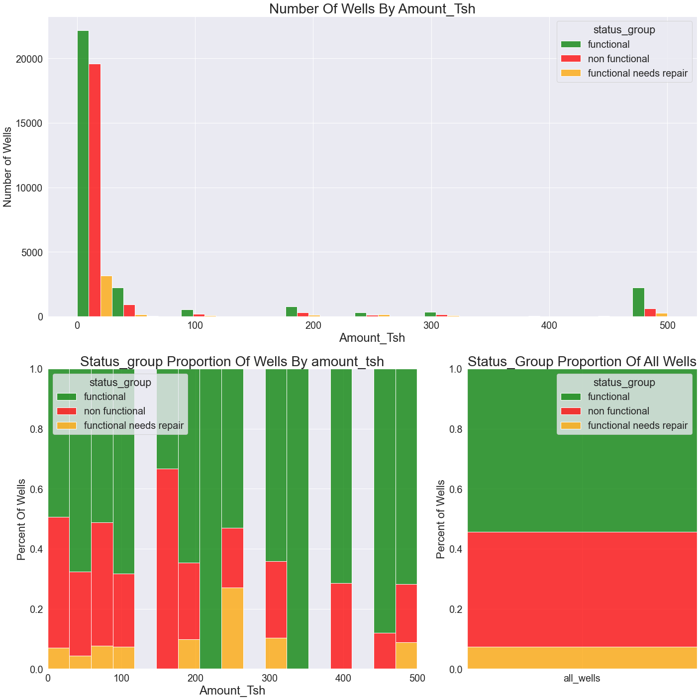
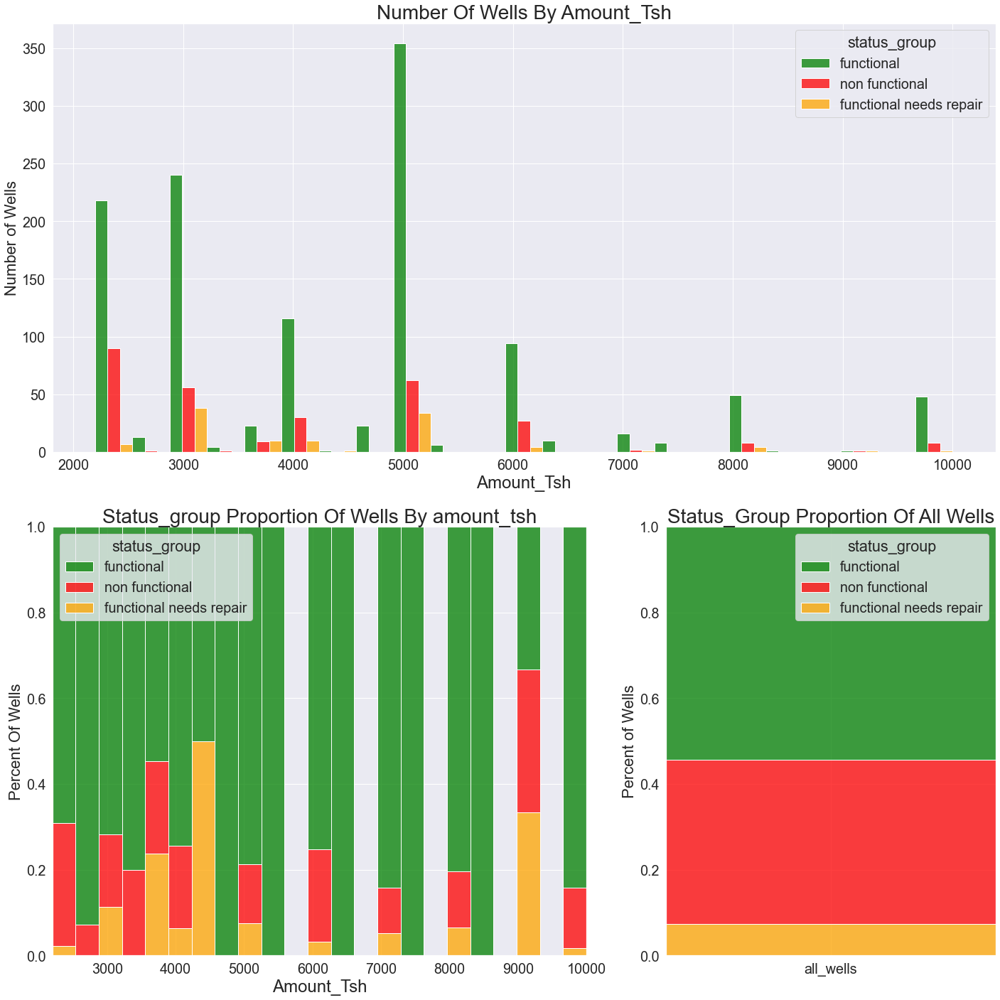

# Tanzanian Water Well Classification Project
## Abstract
The following project is a Classification analysis of the Tanzanian Water Well Project as hosted by Driven Data. The point of this analysis is to design and execute a machine learning model with the intent on making accurate predictions. As a suppliment, this report will include a limited feature analysis of the features used in the classification models. 

This project follows a standard CRISP-DM methodology and is available for download at https://github.com/minthammock/mod3FinalProject

### Authors : Michael Mahoney
#### Email: michaeljosephmahoney@gmail.com

# Data Introduction

    Data columns (total 41 columns):
     #   Column                 Non-Null Count  Dtype  
    ---  ------                 --------------  -----  
     0   id                     59400 non-null  int64  
     1   status_group           59400 non-null  object 
     2   amount_tsh             59400 non-null  float64
     3   date_recorded          59400 non-null  object 
     4   funder                 55765 non-null  object 
     5   gps_height             59400 non-null  int64  
     6   installer              55745 non-null  object 
     7   longitude              59400 non-null  float64
     8   latitude               59400 non-null  float64
     9   wpt_name               59400 non-null  object 
     10  num_private            59400 non-null  int64  
     11  basin                  59400 non-null  object 
     12  subvillage             59029 non-null  object 
     13  region                 59400 non-null  object 
     14  region_code            59400 non-null  int64  
     15  district_code          59400 non-null  int64  
     16  lga                    59400 non-null  object 
     17  ward                   59400 non-null  object 
     18  population             59400 non-null  int64  
     19  public_meeting         56066 non-null  object 
     20  recorded_by            59400 non-null  object 
     21  scheme_management      55523 non-null  object 
     22  scheme_name            31234 non-null  object 
     23  permit                 56344 non-null  object 
     24  construction_year      59400 non-null  int64  
     25  extraction_type        59400 non-null  object 
     26  extraction_type_group  59400 non-null  object 
     27  extraction_type_class  59400 non-null  object 
     28  management             59400 non-null  object 
     29  management_group       59400 non-null  object 
     30  payment                59400 non-null  object 
     31  payment_type           59400 non-null  object 
     32  water_quality          59400 non-null  object 
     33  quality_group          59400 non-null  object 
     34  quantity               59400 non-null  object 
     35  quantity_group         59400 non-null  object 
     36  source                 59400 non-null  object 
     37  source_type            59400 non-null  object 
     38  source_class           59400 non-null  object 
     39  waterpoint_type        59400 non-null  object 
     40  waterpoint_type_group  59400 non-null  object 
    dtypes: float64(3), int64(7), object(31)
    memory usage: 19.0+ MB
## First 5 Rows    

<table border="1" class="dataframe">
  <thead>
    <tr style="text-align: right;">
      <th></th>
      <th>id</th>
      <th>status_group</th>
      <th>amount_tsh</th>
      <th>date_recorded</th>
      <th>funder</th>
      <th>gps_height</th>
      <th>installer</th>
      <th>longitude</th>
      <th>latitude</th>
      <th>wpt_name</th>
      <th>num_private</th>
      <th>basin</th>
      <th>subvillage</th>
      <th>region</th>
      <th>region_code</th>
      <th>district_code</th>
      <th>lga</th>
      <th>ward</th>
      <th>population</th>
      <th>public_meeting</th>
      <th>recorded_by</th>
      <th>scheme_management</th>
      <th>scheme_name</th>
      <th>permit</th>
      <th>construction_year</th>
      <th>extraction_type</th>
      <th>extraction_type_group</th>
      <th>extraction_type_class</th>
      <th>management</th>
      <th>management_group</th>
      <th>payment</th>
      <th>payment_type</th>
      <th>water_quality</th>
      <th>quality_group</th>
      <th>quantity</th>
      <th>quantity_group</th>
      <th>source</th>
      <th>source_type</th>
      <th>source_class</th>
      <th>waterpoint_type</th>
      <th>waterpoint_type_group</th>
    </tr>
  </thead>
  <tbody>
    <tr>
      <th>0</th>
      <td>69572</td>
      <td>functional</td>
      <td>6000.0</td>
      <td>3/14/2011</td>
      <td>Roman</td>
      <td>1390</td>
      <td>Roman</td>
      <td>34.938093</td>
      <td>-9.856322</td>
      <td>none</td>
      <td>0</td>
      <td>Lake Nyasa</td>
      <td>Mnyusi B</td>
      <td>Iringa</td>
      <td>11</td>
      <td>5</td>
      <td>Ludewa</td>
      <td>Mundindi</td>
      <td>109</td>
      <td>True</td>
      <td>GeoData Consultants Ltd</td>
      <td>VWC</td>
      <td>Roman</td>
      <td>False</td>
      <td>1999</td>
      <td>gravity</td>
      <td>gravity</td>
      <td>gravity</td>
      <td>vwc</td>
      <td>user-group</td>
      <td>pay annually</td>
      <td>annually</td>
      <td>soft</td>
      <td>good</td>
      <td>enough</td>
      <td>enough</td>
      <td>spring</td>
      <td>spring</td>
      <td>groundwater</td>
      <td>communal standpipe</td>
      <td>communal standpipe</td>
    </tr>
    <tr>
      <th>1</th>
      <td>8776</td>
      <td>functional</td>
      <td>0.0</td>
      <td>3/6/2013</td>
      <td>Grumeti</td>
      <td>1399</td>
      <td>GRUMETI</td>
      <td>34.698766</td>
      <td>-2.147466</td>
      <td>Zahanati</td>
      <td>0</td>
      <td>Lake Victoria</td>
      <td>Nyamara</td>
      <td>Mara</td>
      <td>20</td>
      <td>2</td>
      <td>Serengeti</td>
      <td>Natta</td>
      <td>280</td>
      <td>NaN</td>
      <td>GeoData Consultants Ltd</td>
      <td>Other</td>
      <td>NaN</td>
      <td>True</td>
      <td>2010</td>
      <td>gravity</td>
      <td>gravity</td>
      <td>gravity</td>
      <td>wug</td>
      <td>user-group</td>
      <td>never pay</td>
      <td>never pay</td>
      <td>soft</td>
      <td>good</td>
      <td>insufficient</td>
      <td>insufficient</td>
      <td>rainwater harvesting</td>
      <td>rainwater harvesting</td>
      <td>surface</td>
      <td>communal standpipe</td>
      <td>communal standpipe</td>
    </tr>
    <tr>
      <th>2</th>
      <td>34310</td>
      <td>functional</td>
      <td>25.0</td>
      <td>2/25/2013</td>
      <td>Lottery Club</td>
      <td>686</td>
      <td>World vision</td>
      <td>37.460664</td>
      <td>-3.821329</td>
      <td>Kwa Mahundi</td>
      <td>0</td>
      <td>Pangani</td>
      <td>Majengo</td>
      <td>Manyara</td>
      <td>21</td>
      <td>4</td>
      <td>Simanjiro</td>
      <td>Ngorika</td>
      <td>250</td>
      <td>True</td>
      <td>GeoData Consultants Ltd</td>
      <td>VWC</td>
      <td>Nyumba ya mungu pipe scheme</td>
      <td>True</td>
      <td>2009</td>
      <td>gravity</td>
      <td>gravity</td>
      <td>gravity</td>
      <td>vwc</td>
      <td>user-group</td>
      <td>pay per bucket</td>
      <td>per bucket</td>
      <td>soft</td>
      <td>good</td>
      <td>enough</td>
      <td>enough</td>
      <td>dam</td>
      <td>dam</td>
      <td>surface</td>
      <td>communal standpipe multiple</td>
      <td>communal standpipe</td>
    </tr>
    <tr>
      <th>3</th>
      <td>67743</td>
      <td>non functional</td>
      <td>0.0</td>
      <td>1/28/2013</td>
      <td>Unicef</td>
      <td>263</td>
      <td>UNICEF</td>
      <td>38.486161</td>
      <td>-11.155298</td>
      <td>Zahanati Ya Nanyumbu</td>
      <td>0</td>
      <td>Ruvuma / Southern Coast</td>
      <td>Mahakamani</td>
      <td>Mtwara</td>
      <td>90</td>
      <td>63</td>
      <td>Nanyumbu</td>
      <td>Nanyumbu</td>
      <td>58</td>
      <td>True</td>
      <td>GeoData Consultants Ltd</td>
      <td>VWC</td>
      <td>NaN</td>
      <td>True</td>
      <td>1986</td>
      <td>submersible</td>
      <td>submersible</td>
      <td>submersible</td>
      <td>vwc</td>
      <td>user-group</td>
      <td>never pay</td>
      <td>never pay</td>
      <td>soft</td>
      <td>good</td>
      <td>dry</td>
      <td>dry</td>
      <td>machine dbh</td>
      <td>borehole</td>
      <td>groundwater</td>
      <td>communal standpipe multiple</td>
      <td>communal standpipe</td>
    </tr>
    <tr>
      <th>4</th>
      <td>19728</td>
      <td>functional</td>
      <td>0.0</td>
      <td>7/13/2011</td>
      <td>Action In A</td>
      <td>0</td>
      <td>Artisan</td>
      <td>31.130847</td>
      <td>-1.825359</td>
      <td>Shuleni</td>
      <td>0</td>
      <td>Lake Victoria</td>
      <td>Kyanyamisa</td>
      <td>Kagera</td>
      <td>18</td>
      <td>1</td>
      <td>Karagwe</td>
      <td>Nyakasimbi</td>
      <td>0</td>
      <td>True</td>
      <td>GeoData Consultants Ltd</td>
      <td>NaN</td>
      <td>NaN</td>
      <td>True</td>
      <td>0</td>
      <td>gravity</td>
      <td>gravity</td>
      <td>gravity</td>
      <td>other</td>
      <td>other</td>
      <td>never pay</td>
      <td>never pay</td>
      <td>soft</td>
      <td>good</td>
      <td>seasonal</td>
      <td>seasonal</td>
      <td>rainwater harvesting</td>
      <td>rainwater harvesting</td>
      <td>surface</td>
      <td>communal standpipe</td>
      <td>communal standpipe</td>
    </tr>
  </tbody>
</table>

# Business Understanding

## General Purpose
This data set was furnished by the driven data website which was kind enough to make this data available. The Data attempts to distinguish the target which is the current working conditions of various water wells in Tanzania. There are too many features to consider individually in this abstract but the general sense of the data feature boil down to the following categories:
* Funding/Ownership/Installation
* The water source of the well
* The type of well
* The Geographic and jurisdictional environs

The general intent of the program is to provide business insights to stakeholders on the following fronts:
* Overall classification of well conditions for investment and sustainability and maintenance needs
* Overall accuracy in predicting existing site condition to save time and reasources for the audit program
* Providing precision predictions on the basis wells that need repairs to timely apply repairs before service is interrupted

# Data Understanding

The data is initially composed of 39 features and one target variable. There is a mix of both continuous and categorical data, however, the set heavily favors categories in a 9 to 30 split. Right away we see that depending on the total number of unique values in each column, the total number of columns could get out of hand rather quickly. Also of note are several coluns that are containers of each other, quickly identified by the "type", "class", "group" and "code" extensions. These features may introduce some unique information but will more than likely be eliminated entirely for multi-colinearity reasons. We proceed with some basics of the data set that wil give us more insight into the overal structure. 

## Target Analysis

<table border="1" class="dataframe">
  <thead>
    <tr style="text-align: right;">
      <th></th>
      <th>functional</th>
      <th>non functional</th>
      <th>functional needs repair</th>
    </tr>
  </thead>
  <tbody>
    <tr>
      <th>Status Group Count</th>
      <td>32259.000000</td>
      <td>22824.000000</td>
      <td>4317.000000</td>
    </tr>
    <tr>
      <th>Status Group Percentage</th>
      <td>0.543081</td>
      <td>0.384242</td>
      <td>0.072677</td>
    </tr>
  </tbody>
</table>

The target variable of this analysis appears to have significan imbalance that will need to be addressed. The nature of a multi-classification allows for some flexibility in how this can be achieved and depending on initial findings, several approaches may be required. 

## Categorical Analysis
With a heavy focus on categories it behooves us to determine what level of feature engineering will be required in order to keep to total number of columns feasibly low. We do a quick investigation of the number of unique values per column. The leftmost column in the visual are all the current columns in the dataset

<table border="1" class="dataframe">
  <thead>
    <tr style="text-align: right;">
      <th></th>
      <th>num_unique_values</th>
    </tr>
  </thead>
  <tbody>
    <tr>
      <th>wpt_name</th>
      <td>37400</td>
    </tr>
    <tr>
      <th>subvillage</th>
      <td>19288</td>
    </tr>
    <tr>
      <th>scheme_name</th>
      <td>2697</td>
    </tr>
    <tr>
      <th>installer</th>
      <td>2146</td>
    </tr>
    <tr>
      <th>ward</th>
      <td>2092</td>
    </tr>
    <tr>
      <th>funder</th>
      <td>1898</td>
    </tr>
    <tr>
      <th>date_recorded</th>
      <td>356</td>
    </tr>
    <tr>
      <th>lga</th>
      <td>125</td>
    </tr>
    <tr>
      <th>region</th>
      <td>21</td>
    </tr>
    <tr>
      <th>extraction_type</th>
      <td>18</td>
    </tr>
    <tr>
      <th>scheme_management</th>
      <td>13</td>
    </tr>
    <tr>
      <th>extraction_type_group</th>
      <td>13</td>
    </tr>
    <tr>
      <th>management</th>
      <td>12</td>
    </tr>
    <tr>
      <th>source</th>
      <td>10</td>
    </tr>
    <tr>
      <th>basin</th>
      <td>9</td>
    </tr>
    <tr>
      <th>water_quality</th>
      <td>8</td>
    </tr>
    <tr>
      <th>payment</th>
      <td>7</td>
    </tr>
    <tr>
      <th>source_type</th>
      <td>7</td>
    </tr>
    <tr>
      <th>extraction_type_class</th>
      <td>7</td>
    </tr>
    <tr>
      <th>waterpoint_type</th>
      <td>7</td>
    </tr>
    <tr>
      <th>payment_type</th>
      <td>7</td>
    </tr>
    <tr>
      <th>quality_group</th>
      <td>6</td>
    </tr>
    <tr>
      <th>waterpoint_type_group</th>
      <td>6</td>
    </tr>
    <tr>
      <th>management_group</th>
      <td>5</td>
    </tr>
    <tr>
      <th>quantity</th>
      <td>5</td>
    </tr>
    <tr>
      <th>quantity_group</th>
      <td>5</td>
    </tr>
    <tr>
      <th>permit</th>
      <td>3</td>
    </tr>
    <tr>
      <th>source_class</th>
      <td>3</td>
    </tr>
    <tr>
      <th>public_meeting</th>
      <td>3</td>
    </tr>
    <tr>
      <th>status_group</th>
      <td>3</td>
    </tr>
    <tr>
      <th>recorded_by</th>
      <td>1</td>
    </tr>
  </tbody>
</table>

Unsuprisingly there are several incredibly diverse columns that will need to be reduced before we can go forth with modeling. But there does seem to be a solid amound of columns with limted diversity that likely won't need prior manipulation

## Continuous Analysis

The continuous data in this set is more limited but still worth an initial investigation into some of the general trends and basic statistics.

<table border="1" class="dataframe">
  <thead>
    <tr style="text-align: right;">
      <th></th>
      <th>id</th>
      <th>amount_tsh</th>
      <th>gps_height</th>
      <th>longitude</th>
      <th>latitude</th>
      <th>num_private</th>
      <th>region_code</th>
      <th>district_code</th>
      <th>population</th>
      <th>construction_year</th>
    </tr>
  </thead>
  <tbody>
    <tr>
      <th>count</th>
      <td>59400.000000</td>
      <td>59400.000000</td>
      <td>59400.000000</td>
      <td>59400.000000</td>
      <td>5.940000e+04</td>
      <td>59400.000000</td>
      <td>59400.000000</td>
      <td>59400.000000</td>
      <td>59400.000000</td>
      <td>59400.000000</td>
    </tr>
    <tr>
      <th>mean</th>
      <td>37115.131768</td>
      <td>317.650385</td>
      <td>668.297239</td>
      <td>34.077427</td>
      <td>-5.706033e+00</td>
      <td>0.474141</td>
      <td>15.297003</td>
      <td>5.629747</td>
      <td>179.909983</td>
      <td>1300.652475</td>
    </tr>
    <tr>
      <th>std</th>
      <td>21453.128371</td>
      <td>2997.574558</td>
      <td>693.116350</td>
      <td>6.567432</td>
      <td>2.946019e+00</td>
      <td>12.236230</td>
      <td>17.587406</td>
      <td>9.633649</td>
      <td>471.482176</td>
      <td>951.620547</td>
    </tr>
    <tr>
      <th>min</th>
      <td>0.000000</td>
      <td>0.000000</td>
      <td>-90.000000</td>
      <td>0.000000</td>
      <td>-1.164944e+01</td>
      <td>0.000000</td>
      <td>1.000000</td>
      <td>0.000000</td>
      <td>0.000000</td>
      <td>0.000000</td>
    </tr>
    <tr>
      <th>25%</th>
      <td>18519.750000</td>
      <td>0.000000</td>
      <td>0.000000</td>
      <td>33.090347</td>
      <td>-8.540621e+00</td>
      <td>0.000000</td>
      <td>5.000000</td>
      <td>2.000000</td>
      <td>0.000000</td>
      <td>0.000000</td>
    </tr>
    <tr>
      <th>50%</th>
      <td>37061.500000</td>
      <td>0.000000</td>
      <td>369.000000</td>
      <td>34.908743</td>
      <td>-5.021597e+00</td>
      <td>0.000000</td>
      <td>12.000000</td>
      <td>3.000000</td>
      <td>25.000000</td>
      <td>1986.000000</td>
    </tr>
    <tr>
      <th>75%</th>
      <td>55656.500000</td>
      <td>20.000000</td>
      <td>1319.250000</td>
      <td>37.178387</td>
      <td>-3.326156e+00</td>
      <td>0.000000</td>
      <td>17.000000</td>
      <td>5.000000</td>
      <td>215.000000</td>
      <td>2004.000000</td>
    </tr>
    <tr>
      <th>max</th>
      <td>74247.000000</td>
      <td>350000.000000</td>
      <td>2770.000000</td>
      <td>40.345193</td>
      <td>-2.000000e-08</td>
      <td>1776.000000</td>
      <td>99.000000</td>
      <td>80.000000</td>
      <td>30500.000000</td>
      <td>2013.000000</td>
    </tr>
  </tbody>
</table>

Outliers are a problem for several of the columns. There's also some columns that are categorical that were improperly coded in an ordinal fashion. Not to mention some missing data has already been imputed as 0 are easily detected in the longitude, and construction year. Looks like our work is cut out for us as we move into the data preperation section. 

# Data Preperation

## Feature Engineering
### Categorical
The first goal is going to be to limit the sheer number of columns that will be created once we onehot encode our columns. We will attempt to combine values in a sensical way. The value counts list gives insight into the split of frequencies that exist in several of the categorical columns. It appears that in the case where there are several hundred or even several thousand unique entires that the majority of the labels are either unique entries or only have a handful of data points. This is a perfect time to use rare-label encoding, a process by which infrequent labels are concatonated into a single lable which will represent their diversity.

An additional point of consideration is to eliminate categorical outliers through engineering. Even in columns with few unique entries, labels with minute representation will likely cause errors during the modeling phase if said label is exclusively in the training or the testing set. The following columns have incredibly rare labels that we will have be absorbed by the other column which is already present.
* scheme_management
* extraction_type
* waterpoint_type

Here is an example of this type of representation as displayed in the extraction_type column

    gravity                      26780
    nira/tanira                   8154
    other                         6430
    submersible                   4764
    swn 80                        3670
    mono                          2865
    india mark ii                 2400
    afridev                       1770
    ksb                           1415
    other - rope pump              451
    other - swn 81                 229
    windmill                       117
    india mark iii                  98
    cemo                            90
    other - play pump               85
    walimi                          48
    climax                          32
    other - mkulima/shinyanga        2
    Name: extraction_type, dtype: int64

There's also some general housekeeping items in terms of other categorical data. The public meeting column is a boolian column which unfortunately doesn't play well with sci-kit learn model object.

### Datetimes
The data has a column pretaining to the date the information was recorded. Due to the cyclical nature of the standard calendar we will seperate the data into the day of the week, calendar day, month and year seperately.
This encodding will better capture if there are any monthly or seasonal trends that persist from year to year.  

### Target Encoding
In general target encodding is frowned upon but in this case we will change the labels only for the purpose of shrinking them. 

## Feature Selection

First and foremost we are going to drop the columns we've replaced with encodded versions

    Data columns (total 45 columns):
     #   Column                     Non-Null Count  Dtype  
    ---  ------                     --------------  -----  
     0   id                         59400 non-null  int64  
     1   status_group               59400 non-null  object 
     2   amount_tsh                 59400 non-null  float64
     3   gps_height                 59400 non-null  int64  
     4   longitude                  59400 non-null  float64
     5   latitude                   59400 non-null  float64
     6   num_private                59400 non-null  int64  
     7   basin                      59400 non-null  object 
     8   region                     59400 non-null  object 
     9   region_code                59400 non-null  int64  
     10  district_code              59400 non-null  int64  
     11  population                 59400 non-null  int64  
     12  public_meeting             56066 non-null  float64
     13  recorded_by                59400 non-null  object 
     14  scheme_management          55523 non-null  object 
     15  scheme_name                31234 non-null  object 
     16  permit                     56344 non-null  float64
     17  construction_year          59400 non-null  int64  
     18  extraction_type            59400 non-null  object 
     19  extraction_type_group      59400 non-null  object 
     20  extraction_type_class      59400 non-null  object 
     21  management                 59400 non-null  object 
     22  management_group           59400 non-null  object 
     23  payment                    59400 non-null  object 
     24  payment_type               59400 non-null  object 
     25  water_quality              59400 non-null  object 
     26  quality_group              59400 non-null  object 
     27  quantity                   59400 non-null  object 
     28  quantity_group             59400 non-null  object 
     29  source                     59400 non-null  object 
     30  source_type                59400 non-null  object 
     31  source_class               59400 non-null  object 
     32  waterpoint_type            59400 non-null  object 
     33  waterpoint_type_group      59400 non-null  object 
     34  encoded_date_recorded      59400 non-null  object 
     35  encoded_funder             55765 non-null  object 
     36  encoded_installer          55745 non-null  object 
     37  encoded_wpt_name           59400 non-null  object 
     38  encoded_subvillage         59029 non-null  object 
     39  encoded_lga                59400 non-null  object 
     40  encoded_ward               59400 non-null  object 
     41  date_recorded_month        59400 non-null  int64  
     42  date_recorded_year         59400 non-null  int64  
     43  date_recorded_day          59400 non-null  int64  
     44  date_recorded_day_of_week  59400 non-null  int64  
    

Often time, data collection techniques leed to caturing of redundant infomation. The following columns are also prime candidates for removal. The process used in determining this list is summarily represented here
* Columns with only one entry
* Columns that serve as ID or ID-like columns
* Columns that are macro version of other columns in the data set. Amoung columns with similar entries or columns that are identified as similar by their names, the column with the most granular information is kept. All others are discarded to discourage feature over-representation.

    Data columns (total 32 columns):
     #    Column                     Non-Null Count  Dtype  
    ---  ------                     --------------  -----  
     0   status_group               59400 non-null  object 
     1   amount_tsh                 59400 non-null  float64
     2   gps_height                 59400 non-null  int64  
     3   longitude                  59400 non-null  float64
     4   latitude                   59400 non-null  float64
     5   num_private                59400 non-null  int64  
     6   basin                      59400 non-null  object 
     7   region                     59400 non-null  object 
     8   district_code              59400 non-null  int64  
     9   population                 59400 non-null  int64  
     10  public_meeting             56066 non-null  float64
     11  scheme_management          55523 non-null  object 
     12  permit                     56344 non-null  float64
     13  construction_year          59400 non-null  int64  
     14  extraction_type            59400 non-null  object 
     15  management                 59400 non-null  object 
     16  payment                    59400 non-null  object 
     17  water_quality              59400 non-null  object 
     18  quantity                   59400 non-null  object 
     19  source                     59400 non-null  object 
     20  waterpoint_type            59400 non-null  object 
     21  encoded_date_recorded      59400 non-null  object 
     22  encoded_funder             55765 non-null  object 
     23  encoded_installer          55745 non-null  object 
     24  encoded_wpt_name           59400 non-null  object 
     25  encoded_subvillage         59029 non-null  object 
     26  encoded_lga                59400 non-null  object 
     27  encoded_ward               59400 non-null  object 
     28  date_recorded_month        59400 non-null  int64  
     29  date_recorded_year         59400 non-null  int64  
     30  date_recorded_day          59400 non-null  int64  
     31  date_recorded_day_of_week  59400 non-null  int64  
    

## Re-entering Null Values
Because there are several columns with null values that were imputed during the data collection process, we will be undoing some of them in order to apply an imputation technique that is consistant for the entire model. 

### Continuous Data
The columns with noticable missing data imputation were the following:
* longitude -- 0 entered which isn't in Tanzania
* latitude -- 2e10 enter which isn't in tanzania
* construction_year -- 0 entered which isn't a feasible year

## Preprocessing Summary
All that remains is to impute our missing null values. Imputation is best left to scikit learn's object interface so we will continue along with creating a pipeline and modeling workflow

    Data columns (total 32 columns):
     #   Column                     Non-Null Count  Dtype  
    ---  ------                     --------------  -----  
     0   status_group               58932 non-null  object 
     1   amount_tsh                 58932 non-null  float64
     2   gps_height                 58932 non-null  int64  
     3   longitude                  57120 non-null  float64
     4   latitude                   57120 non-null  float64
     5   num_private                58932 non-null  int64  
     6   basin                      58932 non-null  object 
     7   region                     58932 non-null  object 
     8   district_code              58932 non-null  int64  
     9   population                 30689 non-null  float64
     10  public_meeting             55606 non-null  float64
     11  scheme_management          55058 non-null  object 
     12  permit                     55882 non-null  float64
     13  construction_year          38237 non-null  float64
     14  extraction_type            58932 non-null  object 
     15  management                 58932 non-null  object 
     16  payment                    58932 non-null  object 
     17  water_quality              58932 non-null  object 
     18  quantity                   58932 non-null  object 
     19  source                     58932 non-null  object 
     20  waterpoint_type            58932 non-null  object 
     21  encoded_date_recorded      58932 non-null  object 
     22  encoded_funder             55306 non-null  object 
     23  encoded_installer          55286 non-null  object 
     24  encoded_wpt_name           58932 non-null  object 
     25  encoded_subvillage         58561 non-null  object 
     26  encoded_lga                58932 non-null  object 
     27  encoded_ward               58932 non-null  object 
     28  date_recorded_month        58932 non-null  int64  
     29  date_recorded_year         58932 non-null  int64  
     30  date_recorded_day          58932 non-null  int64  
     31  date_recorded_day_of_week  58932 non-null  int64  
    dtypes: float64(7), int64(7), object(18)
    memory usage: 14.8+ MB
    

The total is 32 features prior to encodding which should provide us a healthy place for dimensionality. The general rule followed in this notebook is to keep the number of features less than the square-root of the total number of columns (242). Encodding will drastically increase this number but our engineering will keep us under the limit.

# Modeling

## Instantiate the Case and Preprocess the Data
With engineering and feature selection completed all that remains is to impute missing data and onehot encode the categorical columns. This task is much more efficient to be completed within a pipline of sci-kit learn objects and custom objects I created that are meant to support sci-kit learn operations in terms of data organization. All custom objects are well documented and attempt to follow the flow of sci-kit learn in terms of implementation. The following cell will fill and encode all the data. The method impliments the column transformer to handle the categorical and continuous features seperately. For the subsequent models, the following methodology is used:

* Continuous Features - The median is used for imputation and then all data is scaled using z-scores
* Categorical Features - The string 'missing' is used for imputation and then all data is onehot encodded

After the pipeline completes and the features of the training set and testing set have been scaled and encodded, the training features and tartet are resampled using the not majority SMOTE technique. This resamples all minority classes in a synthetic manner in order to equalize the number of samples across all target labels. 

## Gradient Boosted Classification Reports

### Feature Importance
One of the most useful aspects of models is the ability to assign feature importance. Feature importance associates relative numbers to each feature as a means of quantifying how useful each parameter was in determining predictions. These coefficients can be a great way to glearn simplified understanding of the relationship between the features and the target variable. They can also inform future data collection and preprocessing techniques.

<table border="1" class="dataframe">
  <thead>
    <tr style="text-align: right;">
      <th></th>
      <th>features</th>
      <th>importance_magnitude</th>
    </tr>
  </thead>
  <tbody>
    <tr>
      <th>0</th>
      <td>quantity_dry</td>
      <td>0.111293</td>
    </tr>
    <tr>
      <th>1</th>
      <td>longitude</td>
      <td>0.076303</td>
    </tr>
    <tr>
      <th>2</th>
      <td>latitude</td>
      <td>0.056909</td>
    </tr>
    <tr>
      <th>3</th>
      <td>construction_year</td>
      <td>0.041434</td>
    </tr>
    <tr>
      <th>4</th>
      <td>quantity_enough</td>
      <td>0.036670</td>
    </tr>
    <tr>
      <th>5</th>
      <td>extraction_type_gravity</td>
      <td>0.034623</td>
    </tr>
    <tr>
      <th>6</th>
      <td>date_recorded_day_of_week</td>
      <td>0.034150</td>
    </tr>
    <tr>
      <th>7</th>
      <td>district_code</td>
      <td>0.033651</td>
    </tr>
    <tr>
      <th>8</th>
      <td>gps_height</td>
      <td>0.029079</td>
    </tr>
    <tr>
      <th>9</th>
      <td>waterpoint_type_other</td>
      <td>0.028591</td>
    </tr>
    <tr>
      <th>10</th>
      <td>extraction_type_other</td>
      <td>0.024806</td>
    </tr>
    <tr>
      <th>11</th>
      <td>quantity_insufficient</td>
      <td>0.022613</td>
    </tr>
    <tr>
      <th>12</th>
      <td>date_recorded_day</td>
      <td>0.022164</td>
    </tr>
    <tr>
      <th>13</th>
      <td>source_spring</td>
      <td>0.020022</td>
    </tr>
    <tr>
      <th>14</th>
      <td>population</td>
      <td>0.019913</td>
    </tr>
  </tbody>
</table>

## K-Nearest Neighbors Model Reports

## Ranom Forest Model Reports

      

## Support Vector Machine Model Reports

## Summay
The results iluminate a detection issue for the minority class as all the models overfit the needs_repair category in the training data. There could be several reasons for the overfitting including the method of feature engineering, hyper-parameters, or little difference in the actual target class predictors. Ultimately, increasing preformace of the minority class metrics without comprimising overal model preformace may not be possible.

Moving Forward we can adjust the

An assessment of the baseline models leads me to conclude the follow types should be selected for the final modeling portion:
* Gradient Boosted Classifier -- The Best Performing Model Overall with the highest precision for the minority class
* Random Forest Classifier -- Well preforming model that has the second strongest recall for the minority class
* K-Nearest Neighbors Classifier -- Mid-tier preformance with the strongest recall for the minority class

# Evaluation
There's a lot to digest here. Most important is to focus on the models and their results. 

# Stacking Classifier
We're finally here! We have several working models listed below that will be fed into the our stacking classifier. The stacking classifier is a bundle that takes the guesses of the individual models and treats them as features to be fed into a final model. The final model is trained on these new columns and makes a final prediction based on the individual guesses for the testing set. 

## Stacking Classifiers
The two cells below contain the logic of the stacking classifiers to be used. The first stack is going to use a Logistic Regression as the final model to bring everything together. The second stack will add another randomforest as the final estimator. We use two stacks to cover both a regression type and tree type final estimator. Note that we do not need to check the Logistic Regressor for the assumptions of linear modeling 

### Stack 1

<table id="T_2942319a_0813_11eb_871e_9078414e5b0a" ><caption>Stack Train Report</caption><thead>    <tr>        <th class="blank level0" ></th>        <th class="col_heading level0 col0" >needs_repair</th>        <th class="col_heading level0 col1" >not_working</th>        <th class="col_heading level0 col2" >working</th>        <th class="col_heading level0 col3" >accuracy</th>        <th class="col_heading level0 col4" >macro avg</th>        <th class="col_heading level0 col5" >weighted avg</th>    </tr></thead><tbody>
                <tr>
                        <th id="T_2942319a_0813_11eb_871e_9078414e5b0alevel0_row0" class="row_heading level0 row0" >precision</th>
                        <td id="T_2942319a_0813_11eb_871e_9078414e5b0arow0_col0" class="data row0 col0" >0.939007</td>
                        <td id="T_2942319a_0813_11eb_871e_9078414e5b0arow0_col1" class="data row0 col1" >0.955860</td>
                        <td id="T_2942319a_0813_11eb_871e_9078414e5b0arow0_col2" class="data row0 col2" >0.903357</td>
                        <td id="T_2942319a_0813_11eb_871e_9078414e5b0arow0_col3" class="data row0 col3" >0.932257</td>
                        <td id="T_2942319a_0813_11eb_871e_9078414e5b0arow0_col4" class="data row0 col4" >0.932741</td>
                        <td id="T_2942319a_0813_11eb_871e_9078414e5b0arow0_col5" class="data row0 col5" >0.932741</td>
            </tr>
            <tr>
                        <th id="T_2942319a_0813_11eb_871e_9078414e5b0alevel0_row1" class="row_heading level0 row1" >recall</th>
                        <td id="T_2942319a_0813_11eb_871e_9078414e5b0arow1_col0" class="data row1 col0" >0.961129</td>
                        <td id="T_2942319a_0813_11eb_871e_9078414e5b0arow1_col1" class="data row1 col1" >0.914115</td>
                        <td id="T_2942319a_0813_11eb_871e_9078414e5b0arow1_col2" class="data row1 col2" >0.921527</td>
                        <td id="T_2942319a_0813_11eb_871e_9078414e5b0arow1_col3" class="data row1 col3" >0.932257</td>
                        <td id="T_2942319a_0813_11eb_871e_9078414e5b0arow1_col4" class="data row1 col4" >0.932257</td>
                        <td id="T_2942319a_0813_11eb_871e_9078414e5b0arow1_col5" class="data row1 col5" >0.932257</td>
            </tr>
            <tr>
                        <th id="T_2942319a_0813_11eb_871e_9078414e5b0alevel0_row2" class="row_heading level0 row2" >f1-score</th>
                        <td id="T_2942319a_0813_11eb_871e_9078414e5b0arow2_col0" class="data row2 col0" >0.949939</td>
                        <td id="T_2942319a_0813_11eb_871e_9078414e5b0arow2_col1" class="data row2 col1" >0.934522</td>
                        <td id="T_2942319a_0813_11eb_871e_9078414e5b0arow2_col2" class="data row2 col2" >0.912351</td>
                        <td id="T_2942319a_0813_11eb_871e_9078414e5b0arow2_col3" class="data row2 col3" >0.932257</td>
                        <td id="T_2942319a_0813_11eb_871e_9078414e5b0arow2_col4" class="data row2 col4" >0.932271</td>
                        <td id="T_2942319a_0813_11eb_871e_9078414e5b0arow2_col5" class="data row2 col5" >0.932271</td>
            </tr>
            <tr>
                        <th id="T_2942319a_0813_11eb_871e_9078414e5b0alevel0_row3" class="row_heading level0 row3" >support</th>
                        <td id="T_2942319a_0813_11eb_871e_9078414e5b0arow3_col0" class="data row3 col0" >28736.000000</td>
                        <td id="T_2942319a_0813_11eb_871e_9078414e5b0arow3_col1" class="data row3 col1" >28736.000000</td>
                        <td id="T_2942319a_0813_11eb_871e_9078414e5b0arow3_col2" class="data row3 col2" >28736.000000</td>
                        <td id="T_2942319a_0813_11eb_871e_9078414e5b0arow3_col3" class="data row3 col3" >0.932257</td>
                        <td id="T_2942319a_0813_11eb_871e_9078414e5b0arow3_col4" class="data row3 col4" >86208.000000</td>
                        <td id="T_2942319a_0813_11eb_871e_9078414e5b0arow3_col5" class="data row3 col5" >86208.000000</td>
            </tr>
    </tbody></table>

<table id="T_294479e6_0813_11eb_abbf_9078414e5b0a" ><caption>Stack Train Report</caption><thead>    <tr>        <th class="blank level0" ></th>        <th class="col_heading level0 col0" >needs_repair</th>        <th class="col_heading level0 col1" >not_working</th>        <th class="col_heading level0 col2" >working</th>        <th class="col_heading level0 col3" >accuracy</th>        <th class="col_heading level0 col4" >macro avg</th>        <th class="col_heading level0 col5" >weighted avg</th>    </tr></thead><tbody>
                <tr>
                        <th id="T_294479e6_0813_11eb_abbf_9078414e5b0alevel0_row0" class="row_heading level0 row0" >precision</th>
                        <td id="T_294479e6_0813_11eb_abbf_9078414e5b0arow0_col0" class="data row0 col0" >0.417537</td>
                        <td id="T_294479e6_0813_11eb_abbf_9078414e5b0arow0_col1" class="data row0 col1" >0.838465</td>
                        <td id="T_294479e6_0813_11eb_abbf_9078414e5b0arow0_col2" class="data row0 col2" >0.815981</td>
                        <td id="T_294479e6_0813_11eb_abbf_9078414e5b0arow0_col3" class="data row0 col3" >0.791653</td>
                        <td id="T_294479e6_0813_11eb_abbf_9078414e5b0arow0_col4" class="data row0 col4" >0.690661</td>
                        <td id="T_294479e6_0813_11eb_abbf_9078414e5b0arow0_col5" class="data row0 col5" >0.795575</td>
            </tr>
            <tr>
                        <th id="T_294479e6_0813_11eb_abbf_9078414e5b0alevel0_row1" class="row_heading level0 row1" >recall</th>
                        <td id="T_294479e6_0813_11eb_abbf_9078414e5b0arow1_col0" class="data row1 col0" >0.465116</td>
                        <td id="T_294479e6_0813_11eb_abbf_9078414e5b0arow1_col1" class="data row1 col1" >0.779392</td>
                        <td id="T_294479e6_0813_11eb_abbf_9078414e5b0arow1_col2" class="data row1 col2" >0.844347</td>
                        <td id="T_294479e6_0813_11eb_abbf_9078414e5b0arow1_col3" class="data row1 col3" >0.791653</td>
                        <td id="T_294479e6_0813_11eb_abbf_9078414e5b0arow1_col4" class="data row1 col4" >0.696285</td>
                        <td id="T_294479e6_0813_11eb_abbf_9078414e5b0arow1_col5" class="data row1 col5" >0.791653</td>
            </tr>
            <tr>
                        <th id="T_294479e6_0813_11eb_abbf_9078414e5b0alevel0_row2" class="row_heading level0 row2" >f1-score</th>
                        <td id="T_294479e6_0813_11eb_abbf_9078414e5b0arow2_col0" class="data row2 col0" >0.440044</td>
                        <td id="T_294479e6_0813_11eb_abbf_9078414e5b0arow2_col1" class="data row2 col1" >0.807850</td>
                        <td id="T_294479e6_0813_11eb_abbf_9078414e5b0arow2_col2" class="data row2 col2" >0.829922</td>
                        <td id="T_294479e6_0813_11eb_abbf_9078414e5b0arow2_col3" class="data row2 col3" >0.791653</td>
                        <td id="T_294479e6_0813_11eb_abbf_9078414e5b0arow2_col4" class="data row2 col4" >0.692605</td>
                        <td id="T_294479e6_0813_11eb_abbf_9078414e5b0arow2_col5" class="data row2 col5" >0.792974</td>
            </tr>
            <tr>
                        <th id="T_294479e6_0813_11eb_abbf_9078414e5b0alevel0_row3" class="row_heading level0 row3" >support</th>
                        <td id="T_294479e6_0813_11eb_abbf_9078414e5b0arow3_col0" class="data row3 col0" >430.000000</td>
                        <td id="T_294479e6_0813_11eb_abbf_9078414e5b0arow3_col1" class="data row3 col1" >2271.000000</td>
                        <td id="T_294479e6_0813_11eb_abbf_9078414e5b0arow3_col2" class="data row3 col2" >3193.000000</td>
                        <td id="T_294479e6_0813_11eb_abbf_9078414e5b0arow3_col3" class="data row3 col3" >0.791653</td>
                        <td id="T_294479e6_0813_11eb_abbf_9078414e5b0arow3_col4" class="data row3 col4" >5894.000000</td>
                        <td id="T_294479e6_0813_11eb_abbf_9078414e5b0arow3_col5" class="data row3 col5" >5894.000000</td>
            </tr>
    </tbody></table>

### Stack 2

<table id="T_2ef4d318_0813_11eb_84d6_9078414e5b0a" ><caption>Stack Train Report</caption><thead>    <tr>        <th class="blank level0" ></th>        <th class="col_heading level0 col0" >needs_repair</th>        <th class="col_heading level0 col1" >not_working</th>        <th class="col_heading level0 col2" >working</th>        <th class="col_heading level0 col3" >accuracy</th>        <th class="col_heading level0 col4" >macro avg</th>        <th class="col_heading level0 col5" >weighted avg</th>    </tr></thead><tbody>
                <tr>
                        <th id="T_2ef4d318_0813_11eb_84d6_9078414e5b0alevel0_row0" class="row_heading level0 row0" >precision</th>
                        <td id="T_2ef4d318_0813_11eb_84d6_9078414e5b0arow0_col0" class="data row0 col0" >0.950836</td>
                        <td id="T_2ef4d318_0813_11eb_84d6_9078414e5b0arow0_col1" class="data row0 col1" >0.947840</td>
                        <td id="T_2ef4d318_0813_11eb_84d6_9078414e5b0arow0_col2" class="data row0 col2" >0.880525</td>
                        <td id="T_2ef4d318_0813_11eb_84d6_9078414e5b0arow0_col3" class="data row0 col3" >0.925146</td>
                        <td id="T_2ef4d318_0813_11eb_84d6_9078414e5b0arow0_col4" class="data row0 col4" >0.926400</td>
                        <td id="T_2ef4d318_0813_11eb_84d6_9078414e5b0arow0_col5" class="data row0 col5" >0.926400</td>
            </tr>
            <tr>
                        <th id="T_2ef4d318_0813_11eb_84d6_9078414e5b0alevel0_row1" class="row_heading level0 row1" >recall</th>
                        <td id="T_2ef4d318_0813_11eb_84d6_9078414e5b0arow1_col0" class="data row1 col0" >0.950306</td>
                        <td id="T_2ef4d318_0813_11eb_84d6_9078414e5b0arow1_col1" class="data row1 col1" >0.895427</td>
                        <td id="T_2ef4d318_0813_11eb_84d6_9078414e5b0arow1_col2" class="data row1 col2" >0.929705</td>
                        <td id="T_2ef4d318_0813_11eb_84d6_9078414e5b0arow1_col3" class="data row1 col3" >0.925146</td>
                        <td id="T_2ef4d318_0813_11eb_84d6_9078414e5b0arow1_col4" class="data row1 col4" >0.925146</td>
                        <td id="T_2ef4d318_0813_11eb_84d6_9078414e5b0arow1_col5" class="data row1 col5" >0.925146</td>
            </tr>
            <tr>
                        <th id="T_2ef4d318_0813_11eb_84d6_9078414e5b0alevel0_row2" class="row_heading level0 row2" >f1-score</th>
                        <td id="T_2ef4d318_0813_11eb_84d6_9078414e5b0arow2_col0" class="data row2 col0" >0.950571</td>
                        <td id="T_2ef4d318_0813_11eb_84d6_9078414e5b0arow2_col1" class="data row2 col1" >0.920888</td>
                        <td id="T_2ef4d318_0813_11eb_84d6_9078414e5b0arow2_col2" class="data row2 col2" >0.904447</td>
                        <td id="T_2ef4d318_0813_11eb_84d6_9078414e5b0arow2_col3" class="data row2 col3" >0.925146</td>
                        <td id="T_2ef4d318_0813_11eb_84d6_9078414e5b0arow2_col4" class="data row2 col4" >0.925302</td>
                        <td id="T_2ef4d318_0813_11eb_84d6_9078414e5b0arow2_col5" class="data row2 col5" >0.925302</td>
            </tr>
            <tr>
                        <th id="T_2ef4d318_0813_11eb_84d6_9078414e5b0alevel0_row3" class="row_heading level0 row3" >support</th>
                        <td id="T_2ef4d318_0813_11eb_84d6_9078414e5b0arow3_col0" class="data row3 col0" >28736.000000</td>
                        <td id="T_2ef4d318_0813_11eb_84d6_9078414e5b0arow3_col1" class="data row3 col1" >28736.000000</td>
                        <td id="T_2ef4d318_0813_11eb_84d6_9078414e5b0arow3_col2" class="data row3 col2" >28736.000000</td>
                        <td id="T_2ef4d318_0813_11eb_84d6_9078414e5b0arow3_col3" class="data row3 col3" >0.925146</td>
                        <td id="T_2ef4d318_0813_11eb_84d6_9078414e5b0arow3_col4" class="data row3 col4" >86208.000000</td>
                        <td id="T_2ef4d318_0813_11eb_84d6_9078414e5b0arow3_col5" class="data row3 col5" >86208.000000</td>
            </tr>
    </tbody></table>

<table id="T_2ef6a69c_0813_11eb_896e_9078414e5b0a" ><caption>Stack Train Report</caption><thead>    <tr>        <th class="blank level0" ></th>        <th class="col_heading level0 col0" >needs_repair</th>        <th class="col_heading level0 col1" >not_working</th>        <th class="col_heading level0 col2" >working</th>        <th class="col_heading level0 col3" >accuracy</th>        <th class="col_heading level0 col4" >macro avg</th>        <th class="col_heading level0 col5" >weighted avg</th>    </tr></thead><tbody>
                <tr>
                        <th id="T_2ef6a69c_0813_11eb_896e_9078414e5b0alevel0_row0" class="row_heading level0 row0" >precision</th>
                        <td id="T_2ef6a69c_0813_11eb_896e_9078414e5b0arow0_col0" class="data row0 col0" >0.445000</td>
                        <td id="T_2ef6a69c_0813_11eb_896e_9078414e5b0arow0_col1" class="data row0 col1" >0.834380</td>
                        <td id="T_2ef6a69c_0813_11eb_896e_9078414e5b0arow0_col2" class="data row0 col2" >0.801928</td>
                        <td id="T_2ef6a69c_0813_11eb_896e_9078414e5b0arow0_col3" class="data row0 col3" >0.789108</td>
                        <td id="T_2ef6a69c_0813_11eb_896e_9078414e5b0arow0_col4" class="data row0 col4" >0.693769</td>
                        <td id="T_2ef6a69c_0813_11eb_896e_9078414e5b0arow0_col5" class="data row0 col5" >0.788392</td>
            </tr>
            <tr>
                        <th id="T_2ef6a69c_0813_11eb_896e_9078414e5b0alevel0_row1" class="row_heading level0 row1" >recall</th>
                        <td id="T_2ef6a69c_0813_11eb_896e_9078414e5b0arow1_col0" class="data row1 col0" >0.413953</td>
                        <td id="T_2ef6a69c_0813_11eb_896e_9078414e5b0arow1_col1" class="data row1 col1" >0.760898</td>
                        <td id="T_2ef6a69c_0813_11eb_896e_9078414e5b0arow1_col2" class="data row1 col2" >0.859693</td>
                        <td id="T_2ef6a69c_0813_11eb_896e_9078414e5b0arow1_col3" class="data row1 col3" >0.789108</td>
                        <td id="T_2ef6a69c_0813_11eb_896e_9078414e5b0arow1_col4" class="data row1 col4" >0.678182</td>
                        <td id="T_2ef6a69c_0813_11eb_896e_9078414e5b0arow1_col5" class="data row1 col5" >0.789108</td>
            </tr>
            <tr>
                        <th id="T_2ef6a69c_0813_11eb_896e_9078414e5b0alevel0_row2" class="row_heading level0 row2" >f1-score</th>
                        <td id="T_2ef6a69c_0813_11eb_896e_9078414e5b0arow2_col0" class="data row2 col0" >0.428916</td>
                        <td id="T_2ef6a69c_0813_11eb_896e_9078414e5b0arow2_col1" class="data row2 col1" >0.795947</td>
                        <td id="T_2ef6a69c_0813_11eb_896e_9078414e5b0arow2_col2" class="data row2 col2" >0.829807</td>
                        <td id="T_2ef6a69c_0813_11eb_896e_9078414e5b0arow2_col3" class="data row2 col3" >0.789108</td>
                        <td id="T_2ef6a69c_0813_11eb_896e_9078414e5b0arow2_col4" class="data row2 col4" >0.684890</td>
                        <td id="T_2ef6a69c_0813_11eb_896e_9078414e5b0arow2_col5" class="data row2 col5" >0.787513</td>
            </tr>
            <tr>
                        <th id="T_2ef6a69c_0813_11eb_896e_9078414e5b0alevel0_row3" class="row_heading level0 row3" >support</th>
                        <td id="T_2ef6a69c_0813_11eb_896e_9078414e5b0arow3_col0" class="data row3 col0" >430.000000</td>
                        <td id="T_2ef6a69c_0813_11eb_896e_9078414e5b0arow3_col1" class="data row3 col1" >2271.000000</td>
                        <td id="T_2ef6a69c_0813_11eb_896e_9078414e5b0arow3_col2" class="data row3 col2" >3193.000000</td>
                        <td id="T_2ef6a69c_0813_11eb_896e_9078414e5b0arow3_col3" class="data row3 col3" >0.789108</td>
                        <td id="T_2ef6a69c_0813_11eb_896e_9078414e5b0arow3_col4" class="data row3 col4" >5894.000000</td>
                        <td id="T_2ef6a69c_0813_11eb_896e_9078414e5b0arow3_col5" class="data row3 col5" >5894.000000</td>
            </tr>
    </tbody></table>

# Conclusions
## Overview
The Stackers have preformed somewhat admirably, only adding on another tenth to the gradient boosted predictions. This work seems silly when compared to the effort but every little bit counts! Despite our best efforts to increase the detection and precision of the minority class, the ultimate result is underwhelming. Going off of F1 score, stack1 was able to max out at 44%. Thus the minority class will need to be the subject of further study in future examinations. It should be noted that because the stacks have f1 > 33% this does suggest the model is picking some amount of the minority class. Whether the poor result is due to noise, engineering or lack of samples is still unknown.

Looking at the other results there doesn't appear to be an issue with overfitting. Our training metrics are high but not high enough that the discrepancy between the testing set is glaring (with the exception of the minority class). 
## Features
All models with supported feature importance methods appear to be calling out the same categories, although with some debate as to the order. As for recommendations it would be wise to stick to the shap values presented by the Random Forest Model. Shap values are a technical Game Theory approch to understanding feature importance. Shap associates quantities to every feature through a one vs all analysis. This analysis estimates the impact a feature has on the outcome of every row in the data set by preforming calulation with that without said feature, whereby using the difference in score to determine relative strengths. Further discussion of the Shap method is out of the scope of this analysis but the following graph deonstrates the results.

While useful for establishing what features need further inspection, the summary graph doesn't give insight as to what effect the features has on the classification prediction. In order to determine this, we must investigate the individual features more closely. We will explore the top few below.

### Categorical Feature Importance
It makes sense to break up the analysis over data types because of the label frequencies we'll be dealing with when attempting to project the original data onto one column at a time. The following images show these projections.

# Things Not Given The Proper Attention They Deserve!
At the end of every project there are things left unsaid or unexplored. The following is a list of the items I believe to merit further investigation in no order whatsoever
* Data Understanding - Many of the columns involve industry specific verbage that is hard to parse. More research is needed to understand exactly what the features are to provide better insight into how to preprocess. 
* Imputation techniques - This project only used two types of imputation techniques. Specifically KNN Imputation should be explored.