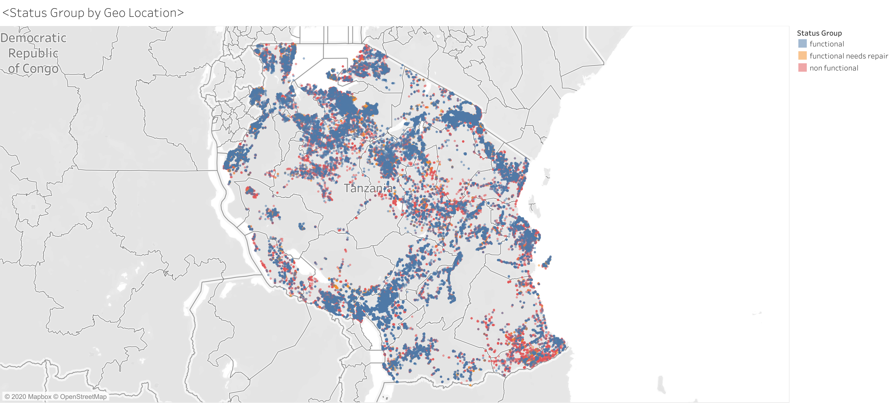

# Tanzanian Water Well Classification Project
## Abstract
The following project is a Classification analysis of the Tanzanian Water Well Project as hosted by Driven Data. The point of this analysis is to design and execute a machine learning model with the intent on making accurate predictions. As a suppliment, this report will include a limited feature analysis of the features used in the classification models. 

This project follows a standard CRISP-DM methodology and is available for download at https://github.com/minthammock/mod3FinalProject

### Authors : Michael Mahoney
#### Email: michaeljosephmahoney@gmail.com

# Recommendations
This is added at the top of the report for easy access and is the same as the recommendations section at the end of the notebook. 

The feature importance evaluation has opened much in the way of business action items. The following are not listed in any particular order but some have more easily realized potential than others.
## 1
### Additional site analysis before building or rebuilding wells that are labelled (or likely to be labelled) dry.
## 2
### If wells must be built in areas that are likely to run dry, perhaps alternative water sources should be explored
## 3
### New builds should avoid well types that would fall under the other category.
## 4
### Retro-fit old wells that are extraction_type other if possible.
## 5
### Gravity wells should be reconsidered as the primary well extraction type due to maintenance issues.
## 6
### New builds and retro-fits should avoid the communal standpipe multiple and other types as the waterpoint. 
## 7
### Wells older than 1990 should be targeted for rebuilds
## 8
### Wells constructed in the 1990s should be placed on maintenance schedules to limit additional non-functionality
## 9
### When planning a well in any given area. Lean towards picking locations with higher elevations.
## 10
### Build well with surrounding populations in the range: 115 > population  > 8.
## 11
### Further investigate before adding or rehabilitating wells in non-functional clusters by geo-location.
## 12
### Screen for tsh. Non-zero tsh wells are more likely to be functional.
## 13
### Wells should be set up under the pay per bucket system and not the never pay system.

# Business Understanding

## Problem Statement: How should the program organize new construction and rehabilitation going into the future

  * Understand the overall status of wells
      * What do we have and how did we get here. 
          * Our target variable in this case is the functionality of individual wells
          * Modeling as a suedo-auditing system
  * Managing maintenance and new construction
      * Finding patterns that will give insight into what wells are likely to fail in the short term
      * When well construction must occur, how to mitigate the risk of non-functionality

# Data Introduction

## General Purpose
This data set was furnished by the driven data website which was kind enough to make this data available. The Data attempts to distinguish the target which is the current working conditions of various water wells in Tanzania. There are too many features to consider individually in this abstract but the general sense of the data feature boil down to the following categories:

* Funding/Ownership/Installation
* The water source of the well
* The type of well
* The Geographic and jurisdictional environs

          #  Column                 Non-Null Count  Dtype  
        ---  ------                 --------------  -----  
         0   id                     59400 non-null  int64  
         1   status_group           59400 non-null  object 
         2   amount_tsh             59400 non-null  float64
         3   date_recorded          59400 non-null  object 
         4   funder                 55765 non-null  object 
         5   gps_height             59400 non-null  int64  
         6   installer              55745 non-null  object 
         7   longitude              59400 non-null  float64
         8   latitude               59400 non-null  float64
         9   wpt_name               59400 non-null  object 
         10  num_private            59400 non-null  int64  
         11  basin                  59400 non-null  object 
         12  subvillage             59029 non-null  object 
         13  region                 59400 non-null  object 
         14  region_code            59400 non-null  int64  
         15  district_code          59400 non-null  int64  
         16  lga                    59400 non-null  object 
         17  ward                   59400 non-null  object 
         18  population             59400 non-null  int64  
         19  public_meeting         56066 non-null  object 
         20  recorded_by            59400 non-null  object 
         21  scheme_management      55523 non-null  object 
         22  scheme_name            31234 non-null  object 
         23  permit                 56344 non-null  object 
         24  construction_year      59400 non-null  int64  
         25  extraction_type        59400 non-null  object 
         26  extraction_type_group  59400 non-null  object 
         27  extraction_type_class  59400 non-null  object 
         28  management             59400 non-null  object 
         29  management_group       59400 non-null  object 
         30  payment                59400 non-null  object 
         31  payment_type           59400 non-null  object 
         32  water_quality          59400 non-null  object 
         33  quality_group          59400 non-null  object 
         34  quantity               59400 non-null  object 
         35  quantity_group         59400 non-null  object 
         36  source                 59400 non-null  object 
         37  source_type            59400 non-null  object 
         38  source_class           59400 non-null  object 
         39  waterpoint_type        59400 non-null  object 
         40  waterpoint_type_group  59400 non-null  object 
        dtypes: float64(3), int64(7), object(31)
        memory usage: 19.0+ MB
    

<table border="1" class="dataframe">
  <thead>
    <tr style="text-align: right;">
      <th></th>
      <th>id</th>
      <th>status_group</th>
      <th>amount_tsh</th>
      <th>date_recorded</th>
      <th>funder</th>
      <th>gps_height</th>
      <th>installer</th>
      <th>longitude</th>
      <th>latitude</th>
      <th>wpt_name</th>
      <th>num_private</th>
      <th>basin</th>
      <th>subvillage</th>
      <th>region</th>
      <th>region_code</th>
      <th>district_code</th>
      <th>lga</th>
      <th>ward</th>
      <th>population</th>
      <th>public_meeting</th>
      <th>recorded_by</th>
      <th>scheme_management</th>
      <th>scheme_name</th>
      <th>permit</th>
      <th>construction_year</th>
      <th>extraction_type</th>
      <th>extraction_type_group</th>
      <th>extraction_type_class</th>
      <th>management</th>
      <th>management_group</th>
      <th>payment</th>
      <th>payment_type</th>
      <th>water_quality</th>
      <th>quality_group</th>
      <th>quantity</th>
      <th>quantity_group</th>
      <th>source</th>
      <th>source_type</th>
      <th>source_class</th>
      <th>waterpoint_type</th>
      <th>waterpoint_type_group</th>
    </tr>
  </thead>
  <tbody>
    <tr>
      <th>0</th>
      <td>69572</td>
      <td>functional</td>
      <td>6000.0</td>
      <td>3/14/2011</td>
      <td>Roman</td>
      <td>1390</td>
      <td>Roman</td>
      <td>34.938093</td>
      <td>-9.856322</td>
      <td>none</td>
      <td>0</td>
      <td>Lake Nyasa</td>
      <td>Mnyusi B</td>
      <td>Iringa</td>
      <td>11</td>
      <td>5</td>
      <td>Ludewa</td>
      <td>Mundindi</td>
      <td>109</td>
      <td>True</td>
      <td>GeoData Consultants Ltd</td>
      <td>VWC</td>
      <td>Roman</td>
      <td>False</td>
      <td>1999</td>
      <td>gravity</td>
      <td>gravity</td>
      <td>gravity</td>
      <td>vwc</td>
      <td>user-group</td>
      <td>pay annually</td>
      <td>annually</td>
      <td>soft</td>
      <td>good</td>
      <td>enough</td>
      <td>enough</td>
      <td>spring</td>
      <td>spring</td>
      <td>groundwater</td>
      <td>communal standpipe</td>
      <td>communal standpipe</td>
    </tr>
    <tr>
      <th>1</th>
      <td>8776</td>
      <td>functional</td>
      <td>0.0</td>
      <td>3/6/2013</td>
      <td>Grumeti</td>
      <td>1399</td>
      <td>GRUMETI</td>
      <td>34.698766</td>
      <td>-2.147466</td>
      <td>Zahanati</td>
      <td>0</td>
      <td>Lake Victoria</td>
      <td>Nyamara</td>
      <td>Mara</td>
      <td>20</td>
      <td>2</td>
      <td>Serengeti</td>
      <td>Natta</td>
      <td>280</td>
      <td>NaN</td>
      <td>GeoData Consultants Ltd</td>
      <td>Other</td>
      <td>NaN</td>
      <td>True</td>
      <td>2010</td>
      <td>gravity</td>
      <td>gravity</td>
      <td>gravity</td>
      <td>wug</td>
      <td>user-group</td>
      <td>never pay</td>
      <td>never pay</td>
      <td>soft</td>
      <td>good</td>
      <td>insufficient</td>
      <td>insufficient</td>
      <td>rainwater harvesting</td>
      <td>rainwater harvesting</td>
      <td>surface</td>
      <td>communal standpipe</td>
      <td>communal standpipe</td>
    </tr>
    <tr>
      <th>2</th>
      <td>34310</td>
      <td>functional</td>
      <td>25.0</td>
      <td>2/25/2013</td>
      <td>Lottery Club</td>
      <td>686</td>
      <td>World vision</td>
      <td>37.460664</td>
      <td>-3.821329</td>
      <td>Kwa Mahundi</td>
      <td>0</td>
      <td>Pangani</td>
      <td>Majengo</td>
      <td>Manyara</td>
      <td>21</td>
      <td>4</td>
      <td>Simanjiro</td>
      <td>Ngorika</td>
      <td>250</td>
      <td>True</td>
      <td>GeoData Consultants Ltd</td>
      <td>VWC</td>
      <td>Nyumba ya mungu pipe scheme</td>
      <td>True</td>
      <td>2009</td>
      <td>gravity</td>
      <td>gravity</td>
      <td>gravity</td>
      <td>vwc</td>
      <td>user-group</td>
      <td>pay per bucket</td>
      <td>per bucket</td>
      <td>soft</td>
      <td>good</td>
      <td>enough</td>
      <td>enough</td>
      <td>dam</td>
      <td>dam</td>
      <td>surface</td>
      <td>communal standpipe multiple</td>
      <td>communal standpipe</td>
    </tr>
    <tr>
      <th>3</th>
      <td>67743</td>
      <td>non functional</td>
      <td>0.0</td>
      <td>1/28/2013</td>
      <td>Unicef</td>
      <td>263</td>
      <td>UNICEF</td>
      <td>38.486161</td>
      <td>-11.155298</td>
      <td>Zahanati Ya Nanyumbu</td>
      <td>0</td>
      <td>Ruvuma / Southern Coast</td>
      <td>Mahakamani</td>
      <td>Mtwara</td>
      <td>90</td>
      <td>63</td>
      <td>Nanyumbu</td>
      <td>Nanyumbu</td>
      <td>58</td>
      <td>True</td>
      <td>GeoData Consultants Ltd</td>
      <td>VWC</td>
      <td>NaN</td>
      <td>True</td>
      <td>1986</td>
      <td>submersible</td>
      <td>submersible</td>
      <td>submersible</td>
      <td>vwc</td>
      <td>user-group</td>
      <td>never pay</td>
      <td>never pay</td>
      <td>soft</td>
      <td>good</td>
      <td>dry</td>
      <td>dry</td>
      <td>machine dbh</td>
      <td>borehole</td>
      <td>groundwater</td>
      <td>communal standpipe multiple</td>
      <td>communal standpipe</td>
    </tr>
    <tr>
      <th>4</th>
      <td>19728</td>
      <td>functional</td>
      <td>0.0</td>
      <td>7/13/2011</td>
      <td>Action In A</td>
      <td>0</td>
      <td>Artisan</td>
      <td>31.130847</td>
      <td>-1.825359</td>
      <td>Shuleni</td>
      <td>0</td>
      <td>Lake Victoria</td>
      <td>Kyanyamisa</td>
      <td>Kagera</td>
      <td>18</td>
      <td>1</td>
      <td>Karagwe</td>
      <td>Nyakasimbi</td>
      <td>0</td>
      <td>True</td>
      <td>GeoData Consultants Ltd</td>
      <td>NaN</td>
      <td>NaN</td>
      <td>True</td>
      <td>0</td>
      <td>gravity</td>
      <td>gravity</td>
      <td>gravity</td>
      <td>other</td>
      <td>other</td>
      <td>never pay</td>
      <td>never pay</td>
      <td>soft</td>
      <td>good</td>
      <td>seasonal</td>
      <td>seasonal</td>
      <td>rainwater harvesting</td>
      <td>rainwater harvesting</td>
      <td>surface</td>
      <td>communal standpipe</td>
      <td>communal standpipe</td>
    </tr>
  </tbody>
</table>

# Data Understanding

The data is initially composed of 39 features and one target variable. There is a mix of both continuous and categorical data, however, the set heavily favors categories in a 9 to 30 split. Right away we see that depending on the total number of unique values in each column, the total number of columns could get out of hand rather quickly. Also of note are several coluns that are containers of each other, quickly identified by the "type", "class", "group" and "code" extensions. These features may introduce some unique information but will more than likely be eliminated entirely for multi-colinearity reasons. We proceed with some basic analysis of the data to get a better underanding of what our workflow will be or this project.

## Target Analysis

<table border="1" class="dataframe">
  <thead>
    <tr style="text-align: right;">
      <th></th>
      <th>functional</th>
      <th>non functional</th>
      <th>functional needs repair</th>
    </tr>
  </thead>
  <tbody>
    <tr>
      <th>Status Group Count</th>
      <td>32259.000000</td>
      <td>22824.000000</td>
      <td>4317.000000</td>
    </tr>
    <tr>
      <th>Status Group Percentage</th>
      <td>0.543081</td>
      <td>0.384242</td>
      <td>0.072677</td>
    </tr>
  </tbody>
</table>

The target variable of this analysis is the column "status_group." It appears to have significant imbalance that will need to be addressed. The nature of a multi-classification allows for some flexibility in how this can be achieved and depending on initial findings, several approaches may be required. 

## Categorical Analysis

With a heavy focus on categories it behooves us to determine what level of feature engineering will be required in order to keep to total number of columns feasibly low. We do a quick investigation of the number of unique values per column. The leftmost column in the visual consist of all the columns in the dataset.

<table border="1" class="dataframe">
  <thead>
    <tr style="text-align: right;">
      <th></th>
      <th>unique_values</th>
    </tr>
  </thead>
  <tbody>
    <tr>
      <th>wpt_name</th>
      <td>37400</td>
    </tr>
    <tr>
      <th>subvillage</th>
      <td>19287</td>
    </tr>
    <tr>
      <th>scheme_name</th>
      <td>2696</td>
    </tr>
    <tr>
      <th>installer</th>
      <td>2145</td>
    </tr>
    <tr>
      <th>ward</th>
      <td>2092</td>
    </tr>
    <tr>
      <th>funder</th>
      <td>1897</td>
    </tr>
    <tr>
      <th>date_recorded</th>
      <td>356</td>
    </tr>
    <tr>
      <th>lga</th>
      <td>125</td>
    </tr>
    <tr>
      <th>region</th>
      <td>21</td>
    </tr>
    <tr>
      <th>extraction_type</th>
      <td>18</td>
    </tr>
    <tr>
      <th>extraction_type_group</th>
      <td>13</td>
    </tr>
    <tr>
      <th>scheme_management</th>
      <td>12</td>
    </tr>
    <tr>
      <th>management</th>
      <td>12</td>
    </tr>
    <tr>
      <th>source</th>
      <td>10</td>
    </tr>
    <tr>
      <th>basin</th>
      <td>9</td>
    </tr>
    <tr>
      <th>water_quality</th>
      <td>8</td>
    </tr>
    <tr>
      <th>payment</th>
      <td>7</td>
    </tr>
    <tr>
      <th>source_type</th>
      <td>7</td>
    </tr>
    <tr>
      <th>extraction_type_class</th>
      <td>7</td>
    </tr>
    <tr>
      <th>waterpoint_type</th>
      <td>7</td>
    </tr>
    <tr>
      <th>payment_type</th>
      <td>7</td>
    </tr>
    <tr>
      <th>quality_group</th>
      <td>6</td>
    </tr>
    <tr>
      <th>waterpoint_type_group</th>
      <td>6</td>
    </tr>
    <tr>
      <th>management_group</th>
      <td>5</td>
    </tr>
    <tr>
      <th>quantity</th>
      <td>5</td>
    </tr>
    <tr>
      <th>quantity_group</th>
      <td>5</td>
    </tr>
    <tr>
      <th>source_class</th>
      <td>3</td>
    </tr>
    <tr>
      <th>status_group</th>
      <td>3</td>
    </tr>
    <tr>
      <th>permit</th>
      <td>2</td>
    </tr>
    <tr>
      <th>public_meeting</th>
      <td>2</td>
    </tr>
    <tr>
      <th>recorded_by</th>
      <td>1</td>
    </tr>
  </tbody>
</table>

Unsuprisingly there are several incredibly diverse columns that will need to be reduced before we can go forth with modeling. But there does seem to be a solid amound of columns with limted diversity that likely won't need prior manipulation

## Continuous Analysis

The continuous data in this set is more limited but still worth an initial investigation into some of the general trends and basic statistics.

<table border="1" class="dataframe">
  <thead>
    <tr style="text-align: right;">
      <th></th>
      <th>id</th>
      <th>amount_tsh</th>
      <th>gps_height</th>
      <th>longitude</th>
      <th>latitude</th>
      <th>num_private</th>
      <th>region_code</th>
      <th>district_code</th>
      <th>population</th>
      <th>construction_year</th>
    </tr>
  </thead>
  <tbody>
    <tr>
      <th>count</th>
      <td>59400.000000</td>
      <td>59400.000000</td>
      <td>59400.000000</td>
      <td>59400.000000</td>
      <td>5.940000e+04</td>
      <td>59400.000000</td>
      <td>59400.000000</td>
      <td>59400.000000</td>
      <td>59400.000000</td>
      <td>59400.000000</td>
    </tr>
    <tr>
      <th>mean</th>
      <td>37115.131768</td>
      <td>317.650385</td>
      <td>668.297239</td>
      <td>34.077427</td>
      <td>-5.706033e+00</td>
      <td>0.474141</td>
      <td>15.297003</td>
      <td>5.629747</td>
      <td>179.909983</td>
      <td>1300.652475</td>
    </tr>
    <tr>
      <th>std</th>
      <td>21453.128371</td>
      <td>2997.574558</td>
      <td>693.116350</td>
      <td>6.567432</td>
      <td>2.946019e+00</td>
      <td>12.236230</td>
      <td>17.587406</td>
      <td>9.633649</td>
      <td>471.482176</td>
      <td>951.620547</td>
    </tr>
    <tr>
      <th>min</th>
      <td>0.000000</td>
      <td>0.000000</td>
      <td>-90.000000</td>
      <td>0.000000</td>
      <td>-1.164944e+01</td>
      <td>0.000000</td>
      <td>1.000000</td>
      <td>0.000000</td>
      <td>0.000000</td>
      <td>0.000000</td>
    </tr>
    <tr>
      <th>25%</th>
      <td>18519.750000</td>
      <td>0.000000</td>
      <td>0.000000</td>
      <td>33.090347</td>
      <td>-8.540621e+00</td>
      <td>0.000000</td>
      <td>5.000000</td>
      <td>2.000000</td>
      <td>0.000000</td>
      <td>0.000000</td>
    </tr>
    <tr>
      <th>50%</th>
      <td>37061.500000</td>
      <td>0.000000</td>
      <td>369.000000</td>
      <td>34.908743</td>
      <td>-5.021597e+00</td>
      <td>0.000000</td>
      <td>12.000000</td>
      <td>3.000000</td>
      <td>25.000000</td>
      <td>1986.000000</td>
    </tr>
    <tr>
      <th>75%</th>
      <td>55656.500000</td>
      <td>20.000000</td>
      <td>1319.250000</td>
      <td>37.178387</td>
      <td>-3.326156e+00</td>
      <td>0.000000</td>
      <td>17.000000</td>
      <td>5.000000</td>
      <td>215.000000</td>
      <td>2004.000000</td>
    </tr>
    <tr>
      <th>max</th>
      <td>74247.000000</td>
      <td>350000.000000</td>
      <td>2770.000000</td>
      <td>40.345193</td>
      <td>-2.000000e-08</td>
      <td>1776.000000</td>
      <td>99.000000</td>
      <td>80.000000</td>
      <td>30500.000000</td>
      <td>2013.000000</td>
    </tr>
  </tbody>
</table>

A few of the columns were improperly coded in an ordinal fashion. Not to mention some missing data has already been imputed. Specifically, longitude and construction year. Looks like our work is cut out for us as we move into the data preperation section. 

# Data Preperation

## Feature Engineering

### Categorical

The first goal is going to be to limit the sheer number of columns that will be created once we onehot encode our columns. We've already detected several columns that have incredible diversity that have need for further investigation. Just as important are the columns that need data adjustment. These columns have data points that have already been imputed from the data collection process.
* latitude
* longitude
* Various categorical columns

It is often the case that missing or corrupted data have filled in values that reflect their unknown nature. We're fortunate that this particula data has imputed these data points with information that is easily identified as false because they cannot possibly be real. 

With categorical data it's often the case that the unknown category becomes computationaly significant in the modeling phase. Rather than filling these data points with information derived from the rest of the data, we will encode these values as missing. 

On the other hand, continuous data must be imputed in such a way that minimizes the affect on the known data. This will be accomplished later in the modeling section for several reasons. Primarily, data imputation that uses metrics of the data itself as the method of filling in must be done after the stage in which we split into training and testing groups, thus avoiding data leakage. Secondly, we will be using models from sklearn which has conveient ways to combine these types of steps. 

As for the engineering aspect, we will attempt to combine values in a sensical way. The value counts list gives insight into the split of frequencies that exist in several of the categorical columns. It appears that in the case where there are several hundred or even several thousand unique entires that the majority of the labels are either unique entries or only have a handful of data points. Therefore, I propose the following concatonation map which offers some feature granularity while respecting the nature of the frequncy distributions.

In general the fewer number of columns we need to alter the better. The cut off we will proceed with for reduction is 21 as the next most diverse column has 120 unique values, a 6-fold increase from the next. There is one exception to this rule, the scheme_name column. We will drop this column in favor of the scheme_management column which will carry more granular information then the encodded scheme_name columns

<table border="1" class="dataframe">
  <thead>
    <tr style="text-align: right;">
      <th></th>
      <th>id</th>
      <th>status_group</th>
      <th>amount_tsh</th>
      <th>date_recorded</th>
      <th>funder</th>
      <th>gps_height</th>
      <th>installer</th>
      <th>longitude</th>
      <th>latitude</th>
      <th>wpt_name</th>
      <th>num_private</th>
      <th>basin</th>
      <th>subvillage</th>
      <th>region</th>
      <th>region_code</th>
      <th>district_code</th>
      <th>lga</th>
      <th>ward</th>
      <th>population</th>
      <th>public_meeting</th>
      <th>recorded_by</th>
      <th>scheme_management</th>
      <th>scheme_name</th>
      <th>permit</th>
      <th>construction_year</th>
      <th>extraction_type</th>
      <th>extraction_type_group</th>
      <th>extraction_type_class</th>
      <th>management</th>
      <th>management_group</th>
      <th>payment</th>
      <th>payment_type</th>
      <th>water_quality</th>
      <th>quality_group</th>
      <th>quantity</th>
      <th>quantity_group</th>
      <th>source</th>
      <th>source_type</th>
      <th>source_class</th>
      <th>waterpoint_type</th>
      <th>waterpoint_type_group</th>
      <th>encoded_wpt_name</th>
      <th>encoded_subvillage</th>
      <th>encoded_installer</th>
      <th>encoded_ward</th>
      <th>encoded_funder</th>
      <th>encoded_date_recorded</th>
      <th>encoded_lga</th>
    </tr>
  </thead>
  <tbody>
    <tr>
      <th>0</th>
      <td>69572</td>
      <td>functional</td>
      <td>6000.0</td>
      <td>3/14/2011</td>
      <td>Roman</td>
      <td>1390</td>
      <td>Roman</td>
      <td>34.938093</td>
      <td>-9.856322</td>
      <td>none</td>
      <td>0</td>
      <td>Lake Nyasa</td>
      <td>Mnyusi B</td>
      <td>Iringa</td>
      <td>11</td>
      <td>5</td>
      <td>Ludewa</td>
      <td>Mundindi</td>
      <td>109</td>
      <td>True</td>
      <td>GeoData Consultants Ltd</td>
      <td>VWC</td>
      <td>Roman</td>
      <td>False</td>
      <td>1999</td>
      <td>gravity</td>
      <td>gravity</td>
      <td>gravity</td>
      <td>vwc</td>
      <td>user-group</td>
      <td>pay annually</td>
      <td>annually</td>
      <td>soft</td>
      <td>good</td>
      <td>enough</td>
      <td>enough</td>
      <td>spring</td>
      <td>spring</td>
      <td>groundwater</td>
      <td>communal standpipe</td>
      <td>communal standpipe</td>
      <td>moderate</td>
      <td>minority</td>
      <td>minority</td>
      <td>minority</td>
      <td>minority</td>
      <td>minority</td>
      <td>minority</td>
    </tr>
    <tr>
      <th>1</th>
      <td>8776</td>
      <td>functional</td>
      <td>0.0</td>
      <td>3/6/2013</td>
      <td>Grumeti</td>
      <td>1399</td>
      <td>GRUMETI</td>
      <td>34.698766</td>
      <td>-2.147466</td>
      <td>Zahanati</td>
      <td>0</td>
      <td>Lake Victoria</td>
      <td>Nyamara</td>
      <td>Mara</td>
      <td>20</td>
      <td>2</td>
      <td>Serengeti</td>
      <td>Natta</td>
      <td>280</td>
      <td>NaN</td>
      <td>GeoData Consultants Ltd</td>
      <td>Other</td>
      <td>NaN</td>
      <td>True</td>
      <td>2010</td>
      <td>gravity</td>
      <td>gravity</td>
      <td>gravity</td>
      <td>wug</td>
      <td>user-group</td>
      <td>never pay</td>
      <td>never pay</td>
      <td>soft</td>
      <td>good</td>
      <td>insufficient</td>
      <td>insufficient</td>
      <td>rainwater harvesting</td>
      <td>rainwater harvesting</td>
      <td>surface</td>
      <td>communal standpipe</td>
      <td>communal standpipe</td>
      <td>extreme_marginal</td>
      <td>minority</td>
      <td>minority</td>
      <td>minority</td>
      <td>minority</td>
      <td>minority</td>
      <td>extreme_marginal</td>
    </tr>
    <tr>
      <th>2</th>
      <td>34310</td>
      <td>functional</td>
      <td>25.0</td>
      <td>2/25/2013</td>
      <td>Lottery Club</td>
      <td>686</td>
      <td>World vision</td>
      <td>37.460664</td>
      <td>-3.821329</td>
      <td>Kwa Mahundi</td>
      <td>0</td>
      <td>Pangani</td>
      <td>Majengo</td>
      <td>Manyara</td>
      <td>21</td>
      <td>4</td>
      <td>Simanjiro</td>
      <td>Ngorika</td>
      <td>250</td>
      <td>True</td>
      <td>GeoData Consultants Ltd</td>
      <td>VWC</td>
      <td>Nyumba ya mungu pipe scheme</td>
      <td>True</td>
      <td>2009</td>
      <td>gravity</td>
      <td>gravity</td>
      <td>gravity</td>
      <td>vwc</td>
      <td>user-group</td>
      <td>pay per bucket</td>
      <td>per bucket</td>
      <td>soft</td>
      <td>good</td>
      <td>enough</td>
      <td>enough</td>
      <td>dam</td>
      <td>dam</td>
      <td>surface</td>
      <td>communal standpipe multiple</td>
      <td>communal standpipe</td>
      <td>minority</td>
      <td>minority</td>
      <td>minority</td>
      <td>minority</td>
      <td>minority</td>
      <td>minority</td>
      <td>minority</td>
    </tr>
    <tr>
      <th>3</th>
      <td>67743</td>
      <td>non functional</td>
      <td>0.0</td>
      <td>1/28/2013</td>
      <td>Unicef</td>
      <td>263</td>
      <td>UNICEF</td>
      <td>38.486161</td>
      <td>-11.155298</td>
      <td>Zahanati Ya Nanyumbu</td>
      <td>0</td>
      <td>Ruvuma / Southern Coast</td>
      <td>Mahakamani</td>
      <td>Mtwara</td>
      <td>90</td>
      <td>63</td>
      <td>Nanyumbu</td>
      <td>Nanyumbu</td>
      <td>58</td>
      <td>True</td>
      <td>GeoData Consultants Ltd</td>
      <td>VWC</td>
      <td>NaN</td>
      <td>True</td>
      <td>1986</td>
      <td>submersible</td>
      <td>submersible</td>
      <td>submersible</td>
      <td>vwc</td>
      <td>user-group</td>
      <td>never pay</td>
      <td>never pay</td>
      <td>soft</td>
      <td>good</td>
      <td>dry</td>
      <td>dry</td>
      <td>machine dbh</td>
      <td>borehole</td>
      <td>groundwater</td>
      <td>communal standpipe multiple</td>
      <td>communal standpipe</td>
      <td>minority</td>
      <td>minority</td>
      <td>minority</td>
      <td>minority</td>
      <td>extreme_marginal</td>
      <td>minority</td>
      <td>minority</td>
    </tr>
    <tr>
      <th>4</th>
      <td>19728</td>
      <td>functional</td>
      <td>0.0</td>
      <td>7/13/2011</td>
      <td>Action In A</td>
      <td>0</td>
      <td>Artisan</td>
      <td>31.130847</td>
      <td>-1.825359</td>
      <td>Shuleni</td>
      <td>0</td>
      <td>Lake Victoria</td>
      <td>Kyanyamisa</td>
      <td>Kagera</td>
      <td>18</td>
      <td>1</td>
      <td>Karagwe</td>
      <td>Nyakasimbi</td>
      <td>0</td>
      <td>True</td>
      <td>GeoData Consultants Ltd</td>
      <td>NaN</td>
      <td>NaN</td>
      <td>True</td>
      <td>0</td>
      <td>gravity</td>
      <td>gravity</td>
      <td>gravity</td>
      <td>other</td>
      <td>other</td>
      <td>never pay</td>
      <td>never pay</td>
      <td>soft</td>
      <td>good</td>
      <td>seasonal</td>
      <td>seasonal</td>
      <td>rainwater harvesting</td>
      <td>rainwater harvesting</td>
      <td>surface</td>
      <td>communal standpipe</td>
      <td>communal standpipe</td>
      <td>extreme_marginal</td>
      <td>minority</td>
      <td>minority</td>
      <td>minority</td>
      <td>minority</td>
      <td>minority</td>
      <td>extreme_marginal</td>
    </tr>
  </tbody>
</table>

An additional point of consideration is to eliminate categorical outliers through engineering. Even in columns with few unique entries, labels with minute representation will likely cause errors during the modeling phase if said label is exclusively in the training or the testing set. The following columns have incredibly rare labels that we will have be absorbed by the other column which is already present.
* scheme_management
* extraction_type
* waterpoint_type

        gravity                      26780
        nira/tanira                   8154
        other                         6430
        submersible                   4764
        swn 80                        3670
        mono                          2865
        india mark ii                 2400
        afridev                       1770
        ksb                           1415
        other - rope pump              451
        other - swn 81                 229
        windmill                       117
        india mark iii                  98
        cemo                            90
        other - play pump               85
        walimi                          48
        climax                          32
        other - mkulima/shinyanga        2
        Name: extraction_type, dtype: int64

There's also some housekeeping items in terms of other categorical data. The public meeting column is a boolian column which unfortunately doesn't play well with sci-kit learn model object. There's also the permit column which is string encodded as true false. These actions are done under the hood. 

We will drop the replaced columns in the final step of preprocessing

### Datetimes
The data has a column pretaining to the date the information was recorded. Due to the cyclical nature of the standard calendar we will seperate the data into the day of the week, calendar day, month and year seperately.
This encodding will better capture if there are any monthly or seasonal trends that persist from year to year.  

### Target Encoding
In general target encodding is frowned upon but in this case it's only purpose is to make some of the visuals prettier!

## Feature Selection

First and foremost we are going to drop the columns we've replaced with encodded versions

     #   Column                     Non-Null Count  Dtype  
    ---  ------                     --------------  -----  
     0   id                         59400 non-null  int64  
     1   status_group               59400 non-null  object 
     2   amount_tsh                 59400 non-null  float64
     3   gps_height                 59400 non-null  int64  
     4   longitude                  59400 non-null  float64
     5   latitude                   59400 non-null  float64
     6   num_private                59400 non-null  int64  
     7   basin                      59400 non-null  object 
     8   region                     59400 non-null  object 
     9   region_code                59400 non-null  int64  
     10  district_code              59400 non-null  int64  
     11  population                 59400 non-null  int64  
     12  public_meeting             56066 non-null  float64
     13  recorded_by                59400 non-null  object 
     14  scheme_management          55523 non-null  object 
     15  scheme_name                31234 non-null  object 
     16  permit                     56344 non-null  float64
     17  construction_year          59400 non-null  int64  
     18  extraction_type            59400 non-null  object 
     19  extraction_type_group      59400 non-null  object 
     20  extraction_type_class      59400 non-null  object 
     21  management                 59400 non-null  object 
     22  management_group           59400 non-null  object 
     23  payment                    59400 non-null  object 
     24  payment_type               59400 non-null  object 
     25  water_quality              59400 non-null  object 
     26  quality_group              59400 non-null  object 
     27  quantity                   59400 non-null  object 
     28  quantity_group             59400 non-null  object 
     29  source                     59400 non-null  object 
     30  source_type                59400 non-null  object 
     31  source_class               59400 non-null  object 
     32  waterpoint_type            59400 non-null  object 
     33  waterpoint_type_group      59400 non-null  object 
     34  encoded_wpt_name           59400 non-null  object 
     35  encoded_subvillage         59029 non-null  object 
     36  encoded_installer          55745 non-null  object 
     37  encoded_ward               59400 non-null  object 
     38  encoded_funder             55765 non-null  object 
     39  encoded_date_recorded      59400 non-null  object 
     40  encoded_lga                59400 non-null  object 
     41  date_recorded_month        59400 non-null  int64  
     42  date_recorded_year         59400 non-null  int64  
     43  date_recorded_day          59400 non-null  int64  
     44  date_recorded_day_of_week  59400 non-null  int64  
    dtypes: float64(5), int64(11), object(29)
    memory usage: 20.8+ MB
    

The following columns are also prime candidates for removal. The process used in determining this list is summarily represented here
* Columns with only one entry
* Columns that serve as ID or ID-like columns
* Columns that are macro version of other columns in the data set. Amoung columns with similar entries or columns that are identified as similar by their names, the column with the most granular information is kept. All others are discarded so discourage over-representation.

         #  Column                     Non-Null Count  Dtype  
        ---  ------                     --------------  -----  
         0   status_group               59400 non-null  object 
         1   amount_tsh                 59400 non-null  float64
         2   gps_height                 59400 non-null  int64  
         3   longitude                  59400 non-null  float64
         4   latitude                   59400 non-null  float64
         5   num_private                59400 non-null  int64  
         6   basin                      59400 non-null  object 
         7   region                     59400 non-null  object 
         8   district_code              59400 non-null  int64  
         9   population                 59400 non-null  int64  
         10  public_meeting             56066 non-null  float64
         11  scheme_management          55523 non-null  object 
         12  permit                     56344 non-null  float64
         13  construction_year          59400 non-null  int64  
         14  extraction_type            59400 non-null  object 
         15  management                 59400 non-null  object 
         16  payment                    59400 non-null  object 
         17  water_quality              59400 non-null  object 
         18  quantity                   59400 non-null  object 
         19  source                     59400 non-null  object 
         20  waterpoint_type            59400 non-null  object 
         21  encoded_wpt_name           59400 non-null  object 
         22  encoded_subvillage         59029 non-null  object 
         23  encoded_installer          55745 non-null  object 
         24  encoded_ward               59400 non-null  object 
         25  encoded_funder             55765 non-null  object 
         26  encoded_date_recorded      59400 non-null  object 
         27  encoded_lga                59400 non-null  object 
         28  date_recorded_month        59400 non-null  int64  
         29  date_recorded_year         59400 non-null  int64  
         30  date_recorded_day          59400 non-null  int64  
         31  date_recorded_day_of_week  59400 non-null  int64  
        dtypes: float64(5), int64(9), object(18)
        memory usage: 15.0+ MB
    

## Re-entering Null Values

Because there are several columns with null values that were imputed during the data collection process, we will be undoing some of them in order to apply an imputation technique that is consistant for the entire model. 
### Continuous Data
The columns with noticable missing data imputation were the following:
* longitude -- 0 entered which isn't in Tanzania
* latitude -- 2e10 enter which isn't in tanzania
* construction_year -- 0 entered which isn't a feasible year

## Preprocessing Summary

All that remains is to impute our missing null values. Imputation is best left to scikit learn's object interface so we will continue along with creating a pipeline and modeling workflow

     #   Column                     Non-Null Count  Dtype  
    ---  ------                     --------------  -----  
     0   status_group               59400 non-null  object 
     1   amount_tsh                 59400 non-null  float64
     2   gps_height                 59400 non-null  int64  
     3   longitude                  57588 non-null  float64
     4   latitude                   57588 non-null  float64
     5   num_private                59400 non-null  int64  
     6   basin                      59400 non-null  object 
     7   region                     59400 non-null  object 
     8   district_code              59400 non-null  int64  
     9   population                 52375 non-null  float64
     10  public_meeting             56066 non-null  float64
     11  scheme_management          55523 non-null  object 
     12  permit                     56344 non-null  float64
     13  construction_year          38691 non-null  float64
     14  extraction_type            59400 non-null  object 
     15  management                 59400 non-null  object 
     16  payment                    59400 non-null  object 
     17  water_quality              59400 non-null  object 
     18  quantity                   59400 non-null  object 
     19  source                     59400 non-null  object 
     20  waterpoint_type            59400 non-null  object 
     21  encoded_wpt_name           59400 non-null  object 
     22  encoded_subvillage         59029 non-null  object 
     23  encoded_installer          55745 non-null  object 
     24  encoded_ward               59400 non-null  object 
     25  encoded_funder             55765 non-null  object 
     26  encoded_date_recorded      59400 non-null  object 
     27  encoded_lga                59400 non-null  object 
     28  date_recorded_month        59400 non-null  int64  
     29  date_recorded_year         59400 non-null  int64  
     30  date_recorded_day          59400 non-null  int64  
     31  date_recorded_day_of_week  59400 non-null  int64  
    dtypes: float64(7), int64(7), object(18)
    memory usage: 15.0+ MB
    

The total is 32 features prior to encodding which should provide us a healthy place for dimensionality. The general rule followed in this notebook is to keep the number of features less than the square-root of the total number of columns (242). Encodding will drastically increase this number but our engineering will keep us under the limit.

# Baseline Models

To begin the analysis we break the preprocessed data up into the target and features

## Instantiate the Case and Preprocess the Data

With engineering and feature selection completed all that remains is to impute missing data and onehot encode the categorical columns. This task is much more efficient to be completed within a pipline of sci-kit learn objects and custom objects I created that are meant to support sci-kit learn operations in terms of data organization. All custom objects are well documented and attempt to follow the flow of sci-kit learn in terms of implementation. The method impliments the column transformer to handle the categorical and continuous features seperately. For the subsequent models, the following methodology is used:

* Continuous Features - The median is used for imputation and then all data is scaled using z-scores
* Categorical Features - The string 'missing' is used for imputation and then all data is onehot encodded

After the pipeline completes and the features of the training set and testing set have been scaled and encodded, the training features and tartet are resampled using the not majority SMOTE technique. This resamples all minority classes in a synthetic manner in order to equalize the number of samples across all target labels. 

## Global Modeling Parameters
Because all of the models we are about to run are encapsulated in grid search objects, we are going to set the n_jobs and 'cv' parameters globally in our model case. Three cross validations will be the limit for all of our models. Otherwise the computational cost will become too high. 

## Gradient Boosted Classification Model
We will include a gradient boosted model in the baseline model round becase it is a consistant and powerful tool that is known to achieve high metrics results.

### Set Parameter Grid
We set up the following parameter list to explore hyper-parameter tunning. The most powerful parameters are the learning rate, max depth and n_estimators parameters. Gradient boosted models tend to overfit so the mex depth parameter is limited to a max of 7. Because the encodded data has nearly 200 features, we keep the learning rate low to encourage model convergance. With a high amount of features the data points are more seperated which makes detection more difficult and larger learning rates will increase the likelihood of missing optimal solutions. The other parameters are being tuned as a matter of course, just in case there are certain combinations that increase model performace.

### Gradient Boosted Reports
We generate a standard classification report as well as confustion matricies for both training and testing set

### Feature Importance
One of the most useful aspects of models is the ability to assign feature importance. Feature importance associates relative numbers to each feature as a means of quantifying how useful each parameter was in determining predictions. These coefficients can be a great way to glearn simplified understanding of the relationship between the features and the target variable.

<table border="1" class="dataframe">
  <thead>
    <tr style="text-align: right;">
      <th></th>
      <th>features</th>
      <th>importance_magnitude</th>
    </tr>
  </thead>
  <tbody>
    <tr>
      <th>0</th>
      <td>quantity_dry</td>
      <td>0.113729</td>
    </tr>
    <tr>
      <th>1</th>
      <td>longitude</td>
      <td>0.079858</td>
    </tr>
    <tr>
      <th>2</th>
      <td>latitude</td>
      <td>0.059778</td>
    </tr>
    <tr>
      <th>3</th>
      <td>construction_year</td>
      <td>0.046802</td>
    </tr>
    <tr>
      <th>4</th>
      <td>waterpoint_type_other</td>
      <td>0.035922</td>
    </tr>
    <tr>
      <th>5</th>
      <td>date_recorded_day</td>
      <td>0.034759</td>
    </tr>
    <tr>
      <th>6</th>
      <td>district_code</td>
      <td>0.034265</td>
    </tr>
    <tr>
      <th>7</th>
      <td>extraction_type_gravity</td>
      <td>0.034124</td>
    </tr>
    <tr>
      <th>8</th>
      <td>gps_height</td>
      <td>0.031395</td>
    </tr>
    <tr>
      <th>9</th>
      <td>quantity_enough</td>
      <td>0.028792</td>
    </tr>
    <tr>
      <th>10</th>
      <td>quantity_insufficient</td>
      <td>0.024511</td>
    </tr>
    <tr>
      <th>11</th>
      <td>region_Shinyanga</td>
      <td>0.022031</td>
    </tr>
    <tr>
      <th>12</th>
      <td>payment_never pay</td>
      <td>0.019851</td>
    </tr>
    <tr>
      <th>13</th>
      <td>extraction_type_other</td>
      <td>0.019709</td>
    </tr>
    <tr>
      <th>14</th>
      <td>source_spring</td>
      <td>0.018244</td>
    </tr>
  </tbody>
</table>

### Evaluation

## K-Nearest Neighbors Model
K-Nearest Neighbors is a vanilla tree model. Because this method doesn't calculate submodels it tends to overfit. The reason we include it is the possibility that the tree detects specific patterns that might be lost in ensemble methods that use aggregated descisions to determine the model predictions.

### Set Parameter Grid
The parameter grid is more straight forward for a single tree. The two parameters tuned here are the total number of allowed leaves and number of neighbors that vote for the classification. If unrestricted, the leaves will likely grow to the length of the number of unique entries in the dataset, so a restriction is necessary. Because our data has many features, we will include 40 and 50 as leaf options which are more than the normal 30 default. The number of neighbors parameter is also increased to 10. With more data points aiding in the classification task 10 neighbors should act as a slight buffer against massive overfitting.

### Reports
We generate a standard classification report as well as confustion matricies for both training and testing set

### Feature Importance
The Sklearn KNearestClassifier object doesn't support feature importance at this time. It is possible to pull out feature information from tree models by counting the number of samples that pass through a given decision node. This is warranted in future research.

### Evaluation

## Ranom Forest Model
Also a tree based model. Random forests are more robust to overfitting than gradient boosted models. For this reason it is also included in the analysis, hopefully to compensate for any overfitting. 

### Set Parameter Grid
The main parameters for this modela are number of estimators, criterion and max depth. Criterion is the most striaght forward as it is the formula used to judge where and when the tree should be split. There are only two options so trying both covers all the bases. The number of estimators if th eoverall number of trees that will be created and will get to vote on the final predictions. The more trees typically means more accurate, however, this approach also deceases the ability to detect minority outcomes which get outvoted as the number increases. For this reason we include 50 as well as the standard 100 and increased amount of 200. Max depth is the number of branches any one path on the tree is allowed to make. Like a KNearestClassifier, uncapped this number will typically grow large as the the tree converges to seperating out individual rows. For this reason, we will cap the depth at a max of 20. In general 20 is considered to be a deep tree, but, given our data set as 200 features, this depth shouldn't in overfitting. 

### Reports
We generate a standard classification report as well as confustion matricies for both training and testing set

### Feature Importance
Luckily, random forests are supported models for a python package caled shap. There will be more info on shap in the final conclusion section. Shap is a tool specifically designed to provide substantial insight in how features play a role in the prediction step. The following cell will provide a magnitude summary of what features were used in the models predictions. While usful, shap is a summation calculation which means it gives information about how important a feature is, not what the exact relationship between the feature and the target is. 

## Support Vector Machine Model
The last model we will be considering is a support vector machine classifier. Admittedly, SVMs are less effective as the dimensionality of the sample space increases which will likely mean it is not the right choice of a model for this data. The reason it's being included is to have a non-tree model be part of the discussion. The diversity in modeling may provide something usful for a final analysis, even if the individual model isn't incredibly strong. 

### Set Parameter Grid

The important parameters for SVMs are kernel and C. Kernel is the type of underlying process that is driving the decisions. We will be looking at radial and logistic kernels which group data points in distinct ways. As for the C parameter (learning rate), we will cover three orders of parameters. Because the sample space, getting the SVM to fully converge on a final model might be tricky so we provide a wide range for this parameter, hoping one of them will work out.  

### Reports
We generate a standard classification report as well as confustion matricies for both training and testing set

### Feature Importance
SVMs also do not support feature importances. This primarily has to do with the way the model makes decisions, as it is more dependant on the spacial configuration of the data and not necessarily the labels we give to the data. 

### Evaluation

## Modeling Summay

The results iluminate a detection issue for the minority class as all the models overfit the needs_repair category in the training data. There could be several reasons for the overfitting including the method of feature engineering, hyper-parameters, or little difference in the actual target class predictors. Ultimately, increasing preformace of the minority class metrics without comprimising overal model preformace may not be possible.

Moving Forward we can adjust the

An assessment of the baseline models leads me to conclude the follow types should be selected for the final modeling portion:
* Gradient Boosted Classifier -- The Best Performing Model Overall with the highest precision for the minority class
* Random Forest Classifier -- Well preforming model that has the second strongest recall for the minority class

# Final Models

We're finally here! We have several working models listed below that will be fed into the our stacking classifier. The stacking classifier is a bundle that takes the guesses of the individual models and treats them as features to be fed into a final model. The final model is trained on these new columns and makes a final prediction based on the individual guesses for the testing set. 

## Stacking Classifiers
The two cells below contain the logic of the stacking classifiers to be used. The first stack is going to use a Logistic Regression as the final model to bring everything together. The second stack will add another randomforest as the final estimator. We use two stacks to cover both a regression type and tree type final estimator. Note that we do not need to check the Logistic Regressor for the assumptions of linear modeling 

## Stacker Reports
Ultimately the Logistic Regressor won out in terms of the best metrics. Here's a more detailed summary of the outcome. 

### Stack Reports

# Final Evaluation / Conclusions

## Overview
The Stackers have preformed somewhat admirably, only adding on another tenth to the gradient boosted predictions. This work seems silly when compared to the effort but every little bit counts! Despite our best efforts to increase the detection and precision of the minority class, the ultimate result is underwhelming. Going off of F1 score, stack1 was able to max out at 44%. Thus the minority class will need to be the subject of further study in future examinations. It should be noted that because the stacks have f1 > 33% this does suggest the model is picking some amount of the minority class. Whether the poor result is due to noise, engineering or lack of samples is still unknown.

Looking at the other results there doesn't appear to be an issue with overfitting. Our training metrics are high but not high enough that the discrepancy between the testing set is glaring (with the exception of the minority class). 

## Features
All models with supported feature importance methods appear to be calling out the same categories, although with some debate as to the order. As for recommendations it would be wise to stick to the shap values presented by the Random Forest Model. Shap values are a technical Game Theory approch to understanding feature importance. Shap associates quantities to every feature through a one vs all analysis. This analysis estimates the impact a feature has on the outcome of every row in the data set by preforming calulation with that without said feature, whereby using the difference in score to determine relative strengths. Further discussion of the Shap method is out of the scope of this analysis but the following graph deonstrates the summary results.

While useful for establishing what features need further inspection, the summary graph doesn't give insight as to what effect the features has on the classification prediction. In order to determine this, we must investigate the individual features more closely. We will explore the top few below.

### Categorical Feature Importance
It makes sense to break up the analysis over data types because of the label frequencies we'll be dealing with when attempting to project the original data onto one column at a time. We will present visuals and a short analysis for each of the top 20 features.

The enough label for the quantity feature tops the list for magnitude. With a comparison to the distribution of our target classification we see that the wells with the enough quantity are somewhat more likely to be functional and slightly less likely to be non-functional than the overal status group distribution. 

The insufficient quantity is only marginally different from the overal distribution.

The dry quantity on the other hand heavily favors the non-functional classification.

Wells that employ a gravity feed system are also slightly favored to be functional vs non-functional. There also appears to be a slight increase in needs repairs.

In addition, those with the extraction_type other are overwhelmingly non functional.

Those that fall under the other type for waterpoint_type are incredibly likely to be non functional wells. 

Wells with the communal standpipe multiple layout are majority non functional. There is also a preceivable increase in the wells that are needing repair.

Being sourced by a river makes a well almost double as likely to be needing repair, however, river sourced wells appear to have high functionality rates than the average. 

Similary with wells that are of the communal standpipe form. 

Wells that are on a never pay system are significantly more likely to be non-functional than average.
Wells that are on a pay per bucket system are more inclined to be functional and needing little repair. 

### Continuous Feature Importance

Districts are more diverse in their makeups. Distric 3 appears to hae a higher likelihood to have non-functional wells when compared to other districts of similar sizes. Distric 6 is much the same. Whereas district 4 and 30 have more functional wells. Rare but still with approximately 1000 wells are districts 33 and 53. Both these districs are more likely to have non-functional wells than functional ones.

Some what intuitively, older wells are much more likely to be non-functional than new ones. Paralleling this, older wells are more likely to be functional but needing repairs that more modern wells. There appears to be a tipping point late 1980 and early 1990s where wells appear to be both functional and non-functional equally likely. 

There are some other interesting population bins that elucidate the other target labels as well. As population grows beyond 200, it seems that no label has a plurality, or in other words functional is a less likely label than average. Note that the view is truncated at 600 for benefit the visual. There are very few data points beyond this scale.

Note the differences in scale in the previeous figures. For wells with no thyroid hormone present, there is a slightly increased chance from the average that the well is non-functional. Other than the 0 reading, with rare exception, virtually all wells are heavily favored to be functional when compared to the average. This to me suggests that the zero entry for the amount_tst column is an imputed value that was missed by our original preprocessing. It was originally included as a valid entry due to the pressense of very small tsh levels being present in the data set. For future research it would be worth re-evaluating the model, replacing these values with a summary statistic from the training data for the amount_tsh column. 

The gps' with heights less than 500 appear to be more likely than average to be non-functional. Whereas, gps' with height greater than 1300 feet are most likely to be functional. 

### Geo-Location Feature Importance

Geo Location ranked prominently among the important features. We will import an image made from tableau public to give a better look at the geography of the status group.

Several of the southern and central regions have distinct areas where wells are non-functional. These sections should be targeted for maintenace construction and remediation.

## General Conclusions

There are enough insights here to derive some useful insights and action items. Here's the quick and dirty version of this reports conclusions. Note that only the top 20 features are considered for this section for limiting the scale of items to a reasonable level. More perfect insight is for the model to infer.
### Wells That Are Likely Broken
* Qyantity : dry
* construction_year < 1985
* Are located near the non-functional clusters as shown on the Geo-Location map. 
* Have negative gps_heights
* excavation_type: communal standpipe multiple, other
* waterpoint_type other
* Payment_type never pay
* district_codes : 33,43,53,63
* gps_height < 500

### Likely To Be Functional Wells
* quantity enough
* source river
* construction_year > 2000
* Payment_type: pay per bucket
* distric_codes : 4, 30
* gps_height > 1250
* amount_tsh > 0

Finding well that are on the boundary category of funtional but needing repairs was a fundamental challenge of this project. The two most important features that appear to offer a clear seperation from the overall data distribution are:
### Well Most Likely To Need Repair
* Gravity excavation type
* river source

These categories imply the wells are slightly more likely to be needing repair than the overal average. 
As with the functional category, wells that have the dry quantity rating are very unlikely to be needing repair. 

# Recommendations

The feature importance evaluation has opened much in the way of business action items. The following are not listed in any particular order but some have more easily realized potential than others.
## 1
### Additional site analysis before building or rebuilding wells that are labelled (or likely to be labelled) dry.
## 2
### If wells must be built in areas that are likely to run dry, perhaps alternative water sources should be explored
## 3
### New builds should avoid well types that would fall under the other category.
## 4
### Retro-fit old wells that are extraction_type other if possible.
## 5
### Gravity wells should be reconsidered as the primary well extraction type due to maintenance issues.
## 6
### New builds and retro-fits should avoid the communal standpipe multiple and other types as the waterpoint. 
## 7
### Wells older than 1990 should be targeted for rebuilds
## 8
### Wells constructed in the 1990s should be placed on maintenance schedules to limit additional non-functionality
## 9
### When planning a well in any given area. Lean towards picking locations with higher elevations.
## 10
### Build well with surrounding populations in the range: 115 > population  > 8.
## 11
### Further investigate before adding or rehabilitating wells in non-functional clusters by geo-location.
## 12
### Screen for tsh. Non-zero tsh wells are more likely to be functional.
## 13
### Wells should be set up under the pay per bucket system and not the never pay system.

# Things Not Given The Proper Attention They Deserve!

At the end of every project there are things left unsaid or unexplored. The following is a list of the items I believe to merit further investigation in no order whatsoever
* Data Understanding - Many of the columns involve industry specific verbage that is hard to parse. More research is needed to understand exactly what the features are to provide better insight into how to preprocess. 
* Imputation techniques - This project only used two types of imputation techniques. Specifically KNN Imputation should be explored.